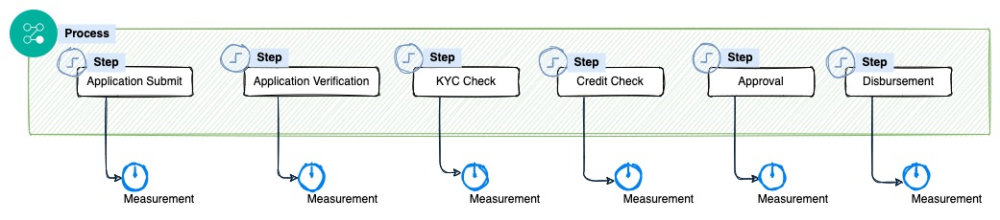
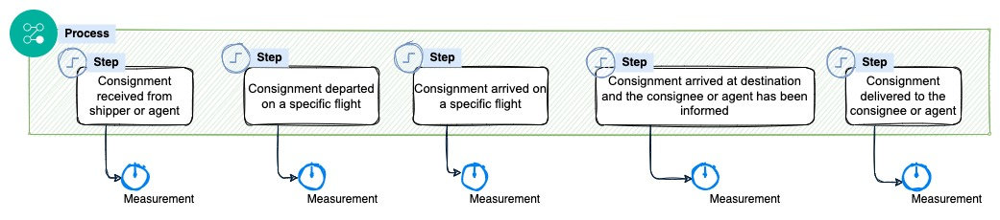
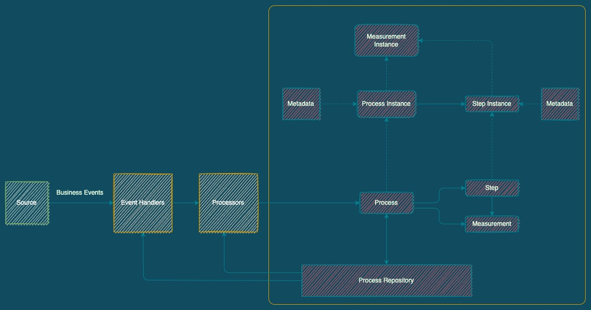
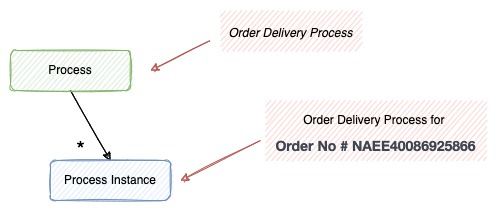
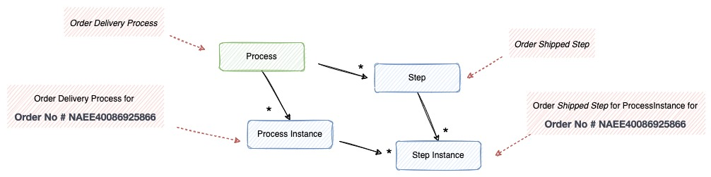
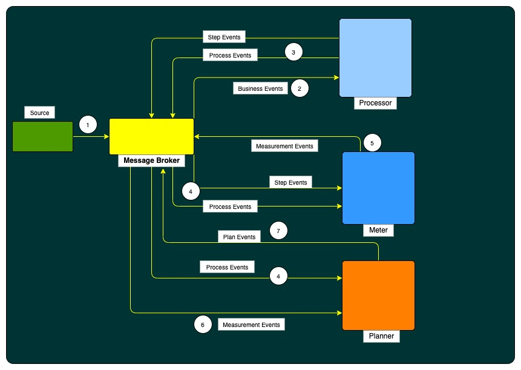

# AKTIMETRIX
## _A Business Process Monitoring Framework_

[](https://nodesource.com/products/nsolid)

[](https://travis-ci.org/joemccann/dillinger)


## Introduction
The Aktimetrix is a lightweight, comprehensive framework designed to facilitate development of robust business process monitoring applications. It also provides more advanced technical services and features that support extremely high volume and high performance business processes through its optimization and partitioning techniques. The framework uses [spring cloud stream](https://spring.io/projects/spring-cloud-stream) (Spring Cloud Stream is a framework for building highly scalable event-driven microservices connected with shared messaging systems).The Aktimetrix Framework is open source.

## What is Business Process Monitoring ? Key Concepts and Terminology
It is important for any business process monitoring application developer to be familiar and comfortable with the main concepts of business process monitoring. Business Process Monitoring is the proactive and process oreiented monitoring of a company's core business processes. 

An example process for loan account processing in banking domain can be defined as below.
   


Another example for for air cargo transportation is given below.
    


The diagram below is a simplified version of the business process monitoring reference architecture. It introduces the key concepts and terms relevant to business process monitoring, as used by Aktimetrix.


 
As shown in our business process monitoring example, a business process is typically encapsulated by a _Process_ consisting of multiple _Steps_. A Process is instantiated by a _Event Handlers_ and _Processors_, and _metadata_ is a key value pair which will store the domain entity information of the process being monitored.
Configured Processes are stored in Process Repository. 

This section describes stereotypes relating to the concept of a business process.
### Process


 A Process is an entity that encapsulates an entire business process. A Process is wired together with a configuration. This configuration may be referred to as the "process definition". However, Process is just the top of an overall hierarchy, as shown in the following diagram:

In Aktimetrix, a Process is simply a container for Step instances. It combines multiple steps that belong logically together in a flow and allows for configuration of properties global to all steps. The Process configuration contains:

1. The simple code of the Process.
2. The simple name of the Process.
3. Definition and ordering of Step instances.
4. The event configuration.

### Process Instance
A _ProcessInstance_ refers to the concept of a logical _Process_ run. Consider a business process that should be run for each business entity (Order), such as the 'Order Delivery' Process from the preceding diagram. There is one 'Order Delivery' process, but each individual run of the process must be tracked separately. In the case of this process, there is one logical ProcessInstance per order. For example, there is a separate ProcessInstance for _Order No # NAEE40086925866_ run, a _Order No # NAEE40034644935_ run, and so on. 

### Step & StepInstance
A Step is a domain object that encapsulates an independent, sequential phase of a business process. Therefore, every Process is composed entirely of one or more steps. A Step contains all of the information necessary to define and control the actual business process monitoring. As with a Process, a Step has an individual StepInstance that correlates with a unique ProcessInstance, as shown in the following image:



### Metadata
In the preceding example, where there are two process instances, one for _Order # NAEE40086925866_, and another for _Order #NAEE40034644935_ , there is really only one Process, but it has two metadata objects: one that was created for _Order # NAEE40086925866_, and another for _Order #NAEE40034644935_ . Thus, the contract can be defined as: _**ProcessInstance = Process + identifying Metadata**_. This allows a developer to effectively control how a ProcessInstance is defined, since they control what metadata are passed in.

## Features
Aktimetrix framework provides below high level features.

- A REST API for defining the reference data for designing business processes
- Java annotations to configure the behaviors in the Aktimetrix Framework.
- General purposed utility functions for achieving features such as business process planning, monitoring and control.
- A notification framework for notifying business stakeholders

## Whats Available
Aktimetrix provides the framework for building business monitoring applications.

## Domain language of Atkimetrix

Aktimetrix primarily exposes below domain language.
_Reference Data_
- Process   - A Collection of Steps
- Step      - A individual milestone in the process
- Metadata  - A domain specific information in the form of Key Value Pairs.
- Measurement - A definition of calculation to be performed
- Metric    - Aggregation of measurements
- Business Entity   - External business object whos process need to be monitored into the aktimetrix.
- Process Instance  - Instance of process for the belong to business entity
- Step Instance - Instance of step
- Measurement Instance  - Instance of measurement
- Metric Instance   - Instance of metric
- Process Plan

An example process and step composition for loan account processing in banking domain is given below.
   


Sample process and step composition for air cargo transportation is given below.
    


The following are the primary APIs which are included as part of aktimetrix framework.

- **_Reference data API_** - This REST style API will allow to define the reference data required for aktimetrix such as process definitions, step definitions, measurement definitions and metric definitions.(more about these in coming sections)
- **_Processor API_** - Processor API allows to create the process instance and step instance etc for each business entity.
- **_Meter API_** - Meter API will capture measurements from the incoming process instance event and step instance events.
- **_Planner API_** - Planner API will allow to create the plan based on the process instance, step instance and measurement instances.

Aktimetrix requires [Java](https://www.oracle.com/java/technologies/) v8+ and [spring boot] v2.6.6 to run.

## Tech

Aktimetrics uses a number of open source projects to work properly:

- [Apache Kafka] - Apache Kafka is a distributed event store and stream-processing platform.!
- [Mongodb] - MongoDB is a source-available cross-platform document-oriented database program.
- [Spring Cloud Steam] - Markdown parser done right. Fast and easy to extend.
- [Java 8+] - Java Language
- [Maven] - Apache Maven is a software project management and comprehension tool.
- [Docker] - Docker is a set of platform as a service products that use OS-level virtualization to deliver software in packages called containers.
 ..and more

And of course Aktimetrix itself is open source with a [public repository][aktimetrix] on GitHub.
Install the dependencies and devDependencies and start the server.

## Development

Lets create a headless [No UI] reference business monitoring application for e-commerce domain with aktimetrix framework and call it as _**E-Buzz_Monitor**_. E-Buzz_Monitor aim is to monitor each order placed by any customer in e-commerce website. E-Buzz_Monitor will be placed outside the business application(e-commerce website) and subsribes to the events published by the e-commerce website.

For monitoring the orders life cycle, lets breakdown the application into 4 microservices. Each microservice will perform certain functionalities. 

1. Processor -- Subscribes to the business events and publishes the process and step events.
2. Meter    -- Subscribes to step events and generate the planned measurement events.
3. Planner  -- Subscribes to process and measurment events and publish the plan events.
4. Monitor  -- Subscribes to the business events and update the status of process and steps.

Our e-commerce business monitoring application architecture is given below:



As shown above, A reference product for business processing application can we defined with event-driven microservices for monitoring a business entity.
Product will contain 3 micro services.

The above microservice components uses a common messaging system for publishing and consuming external and internal events.

## Processor

Processor Application is a event-driven microservices responsible for consuming the business events from sources and generates the process and step level events for each business entity. 
For example, processor consumes booking events and generates process instance and step instance events for each of the bookings.

1. Create a base spring boot application using [spring initializer](https://start.spring.io/).
Add aktimetrix core dependency to the project

```java
<dependency>
    <groupId>com.aktimetrix</groupId>
    <artifactId>aktimetrix-core</artifactId>
    <version>0.0.1-SNAPSHOT</version>
</dependency>
```
2. Create the reference data
    Aktimetrix exposes REST API for creating reference data for process definitions, step definitions.
    Refer [Aktimetrix reference data API documentation]()

3. Create event handler for managing business event. 

##### Event Handler
Event handlers are responsible for processing the external business events. For example, A booking event handler will be used to process 'Booking' events from an Airline reservation system.

A booking event handler will be created by extend the AbstractEventHandler class from aktimetrix core and override the entityId(Event<?,?> event) and eventType(Event<?,?> event) method. 

Event Handler class should by annotated with @EventHandler as shown below. 
```java
@EventHandler(eventType = EventType.BKD)
public class BKDEventHandler extends AbstractEventHandler {
    ...
    @Override
    public void handle(Event<?, ?> event) {
        super.handle(event);
    }
    
    @Override
     public String entityId(Event<?, ?> event){
         Cargo cargo = (Cargo)event.getEntity();
         String entityId = cargo.getDocumentInfo().getAwbInfo().getDocumentPrefix() + "-" + cargo.getDocumentInfo().getAwbInfo().getDocumentNumber(); // domain specific entity id
        return entityId;
     }
     
    @Override
    public String entityType(Event<?, ?> event){
        return "ciq.cargo.awb" // domain specific namespace
     }
    ..
}
```
The above event handler will search for the [process definitions]() whos start event is defined as 'BKD' and execute the processor (more on the processors in coming sections) configured for that process.

4. Create a Processor.

### Processor
Processors are responsible for creating the process instance and step instances associated with the business process for each of the entity. Processor will read the definitions from the reference data.

Any business/domain specific infromation can be stored as metadata. A metadata can be associated with _process instance_ or _step instance_ .

For example in [IATA Cargo IQ - CDMP-C](https://www.iata.org/en/programs/cargo/cargoiq/) process cargo information can be associated with process instance of air waybill process.

```java
@Component
@ProcessHandler(processType = ProcessType.CDMP_C)
public class CiQA2AProcessor extends AbstractProcessor {
     @Override
    protected Map<String, Object> getStepMetadata(ProcessContext context) 
    {
        return new HashMap<>();
    }
    @Override
    protected Map<String, Object> getProcessMetadata(ProcessContext context) 
    {
        return new HashMap<>();
    }
}
```

Additionally _MetadataProvider_ interface can be implemented to provide the metadata for the process and step.

_AbstractProcessor_ is responsible for creating process and step instances for a business entity identified by entityId and entityType.
It also publishes the process and step events. More on events given below.

To perform additional functionalities to the base functionality, PreProcessor and PostProcessor components can be defined. Aktimetrix will identify the Pre and Post Processors for a Process and execute them in sequence. The sequence of the execution can be defined by settings the priority.

The below will will define a post processfor for a '_A2ATRANSPORT_' process

```java
@com.aktimetrix.core.stereotypes.PostProcessor(priority = 100, code = "PI_PUBLISHER", processType = ProcessType.A2ATRANSPORT)
public class ProcessInstancePublisherService implements PostProcessor {
  
    @Override
    public void postProcess(ProcessContext context) {
        ...
    }
}
```

### Meter

A Meter Application consume Process Events and Step Events, and generates the measurements based on the measurement definitions configured for process and step. This application can use aktimetrix framework to automate the measurment calculation for a step and/or process.

Similar to Process Application, create spring boot application and add the aktimetrix-core depenecy to the application.

##### 1. Prepare the definitions
With the Aktimetrix REST api define the measurement definitions and metrix definitions. measurements can be defined at process level or step level.

##### 2. Create Measurement Generator for Step (example for ARR step)
Create a meter by extending AbstractMeter. Meter should be annotated with @Measurement
"_Meter is used to calculate the measurment_"
```java
@Measurement(code = "TIME", stepCode = "ARR")
public class ARRPlanTimeMeter extends AbstractMeter {
     @Override
    protected String getMeasurementUnit(String tenant, StepInstance step) {
        return "TIMESTAMP";
    }
    @Override
    protected String getMeasurementValue(String tenant, StepInstance step) {
        ...
    }
}
```
Here _code_ refers the name given to the measurement and _stepCode_ will refer to step code for which this meter will be associated.
_*Currently AbstractMeter calculate step level measurements_.

##### 3. Create Event Handler

Processor Application publishes the Process Instance Events and Step Instance Events. Meter Application can subscribe these events and generate the measurement from the step instance events and process instance events.

A Step Event handler in Meter Application will be created by extending the _AbstractStepEventHandler_ class from _aktimetrix core_ and override the entityId(Event<?,?> event) and eventType(Event<?,?> event) method.

Step Event handler will calculate the measurements applicable for the step (based on step definition)

```java
@EventHandler(eventType = EventType.STEP_CREATED)
public class StepEventHandler extends AbstractStepEventHandler {

    public StepEventHandler(RegistryService registryService) {
        super(registryService);
    }
    
    @Override
    public String entityId(Event<?,?> event) {
        ..
    }
    @Override
    public String entityType(Event<?,?> event) {
        ...
    }
}
```

##### 4. Create Measurment Generator
Aktimetrix providers a default measurment generator processors ('METERPROCESSOR'). This processor will fetch the measurement definitions availbel for the step( from definition) and executed them one by one. 
All the generated measurements will published to an output topic.


### Planner
// TODO
Want to contribute? Great!

Aktimetric uses Spring + Spring boot for fast developing.
Make a change in your file and instantaneously see your updates!

### Deployment

## License

MIT

**Free Software, Hell Yeah!**

[//]: # (These are reference links used in the body of this note and get stripped out when the markdown processor does its job. There is no need to format nicely because it shouldn't be seen. Thanks SO - http://stackoverflow.com/questions/4823468/store-comments-in-markdown-syntax)
   [Apache Kafka]: <https://kafka.apache.org/>
   [Mongodb]: <https://www.mongodb.com/>
   [Spring Cloud Steam]: <https://spring.io/projects/spring-cloud-stream>
   [Java 8+]: <https://www.oracle.com/ae/java/technologies/>
   [Maven]: <https://maven.apache.org/>
   [aktimetrix]: <https://github.com/arun406/aktimetrix>
   [spring boot]: <https://spring.io/projects/spring-boot>
   [dill]: <https://github.com/joemccann/dillinger>
   [git-repo-url]: <https://github.com/joemccann/dillinger.git>
   [john gruber]: <http://daringfireball.net>
   [df1]: <http://daringfireball.net/projects/markdown/>
   [markdown-it]: <https://github.com/markdown-it/markdown-it>
   [Ace Editor]: <http://ace.ajax.org>
   [node.js]: <http://nodejs.org>
   [Twitter Bootstrap]: <http://twitter.github.com/bootstrap/>
   [jQuery]: <http://jquery.com>
   [@tjholowaychuk]: <http://twitter.com/tjholowaychuk>
   [express]: <http://expressjs.com>
   [AngularJS]: <http://angularjs.org>
   [Gulp]: <http://gulpjs.com>
   [Docker]: <https://www.docker.com/>
   [PlDb]: <https://github.com/joemccann/dillinger/tree/master/plugins/dropbox/README.md>
   [PlGh]: <https://github.com/joemccann/dillinger/tree/master/plugins/github/README.md>
   [PlGd]: <https://github.com/joemccann/dillinger/tree/master/plugins/googledrive/README.md>
   [PlOd]: <https://github.com/joemccann/dillinger/tree/master/plugins/onedrive/README.md>
   [PlMe]: <https://github.com/joemccann/dillinger/tree/master/plugins/medium/README.md>
   [PlGa]: <https://github.com/RahulHP/dillinger/blob/master/plugins/googleanalytics/README.md>
