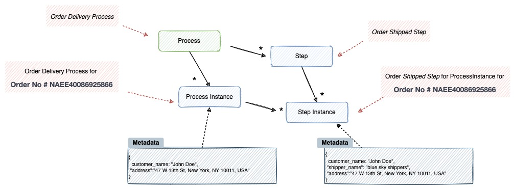
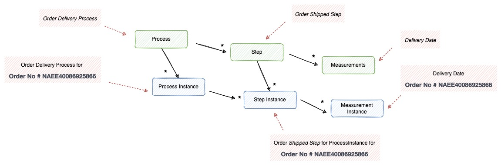

# AKTIMETRIX
## _A Business Process Monitoring Framework_

## Introduction
The Aktimetrix is a lightweight, comprehensive framework designed to facilitate development of robust business process monitoring applications. It also provides more advanced technical services and features that support extremely high volume and high performance business processes through its optimization and partitioning techniques. The framework uses [spring cloud stream](https://spring.io/projects/spring-cloud-stream) (Spring Cloud Stream is a framework for building highly scalable event-driven microservices connected with shared messaging systems).The Aktimetrix Framework is open source.

## What is Business Process Monitoring ? Key Concepts and Terminology
It is important for any business process monitoring application developer to be familiar and comfortable with the main concepts of business process monitoring. Business Process Monitoring is the proactive and process oreiented monitoring of a company's core business processes. 

An example process for loan account processing in banking domain can be defined as below.
   

Another example for for air cargo transportation is given below.
    

Another example for for e-commerce order delivery process is given below.
    

The diagram below is a simplified version of the business process monitoring reference architecture. It introduces the key concepts and terms relevant to business process monitoring, as used by Aktimetrix.

 
As shown in our business process monitoring example, a business process is typically encapsulated by a _Process_ consisting of multiple _Steps_. A Process is instantiated by a _Event Handlers_ and _Processors_, and _metadata_ is a key value pair which will store the domain entity information of the process being monitored.
Configured Processes are stored in Process Repository. 

This section describes stereotypes relating to the concept of a business process.
### Process

A Process is an entity that encapsulates an entire business process. A Process is wired together with a configuration. This configuration may be referred to as the "process definition". However, Process is just the top of an overall hierarchy, as shown in the following diagram:

In Aktimetrix, a Process is simply a container for Step instances. It combines multiple steps that belong logically together in a flow and allows for configuration of properties global to all steps. The Process configuration contains:

1. The simple code of the Process.
2. The simple name of the Process.
3. Definition and ordering of Step instances.
4. The event configuration.

### Process Instance
A _ProcessInstance_ refers to the concept of a logical _Process_ run. Consider a business process that should be run for each business entity (Order), such as the 'Order Delivery' Process from the preceding diagram. There is one 'Order Delivery' process, but each individual run of the process must be tracked separately. In the case of this process, there is one logical ProcessInstance per order. For example, there is a separate ProcessInstance for _Order No # NAEE40086925866_ run, a _Order No # NAEE40034644935_ run, and so on. 

### Step & StepInstance
A Step is a domain object that encapsulates an independent, sequential phase of a business process. Therefore, every Process is composed entirely of one or more steps. A Step contains all of the information necessary to define and control the actual business process monitoring. As with a Process, a Step has an individual StepInstance that correlates with a unique ProcessInstance, as shown in the following image:

### Metadata
In the preceding example, where there are two process instances, one for _Order # NAEE40086925866_, and another for _Order #NAEE40034644935_ , there is really only one Process, but it has two metadata objects: one that was created for _Order # NAEE40086925866_, and another for _Order #NAEE40034644935_ . Thus, the contract can be defined as: _**ProcessInstance = Process + identifying Metadata**_. This allows a developer to effectively control how a ProcessInstance is defined, since they control what metadata are passed in. Metadata can be used for storing the reference data and domain entity data such as order details, customer details, city information, etc.,

### Measurement
Measurements are raw data captured for a business entity. As per the preceding example, delivery start time, delivery end time, shipped datetime, planned time for delivery are some measurement which can be capture for a ProcessInstance or StepInstance for an order. These measurements can be categoried as planned and actual. Similar to Process and Step, measurement will have _MeasurementInstance_ for each measurement. Planned measurements are expected values and actuals the real values captured for an business entity.  For example, order planned delivery time for _Order # NAEE40086925866_ it can be 27-04-2022 12:00 and for _Order #NAEE40034644935_ can be  29-04-2022 18:00. Planned vs Actual values will provide the status of the ProcessInstance and StepInstance. 

## Summary Domain language

Aktimetrix primarily exposes below domain language.

- Process   - A Collection of Steps
- Step      - A individual milestone in the process
- Metadata  - A domain specific information in the form of Key Value Pairs.
- Measurement - A definition of calculation to be performed
- Business Entity   - External business object whos process need to be monitored into the aktimetrix.
- Process Instance  - Instance of process for the belong to business entity
- Step Instance - Instance of step
- Measurement Instance  - Instance of measurement

## Features
Aktimetrix framework provides below high level features.

- A REST API for defining the reference data for designing business processes
- Java annotations to configure the behaviors in the Aktimetrix Framework.
- General purposed utility functions for achieving features such as business process planning, monitoring and control.
- A notification framework for notifying business stakeholders

The following are the primary APIs which are included as part of aktimetrix framework.

- **_Reference data API_** - This REST style API will allow to define the reference data required for aktimetrix such as process definitions, step definitions, measurement definitions and metric definitions.(more about these in coming sections)
- **_Processor API_** - Processor API allows to create the process instance and step instance etc for each business entity.
- **_Meter API_** - Meter API will capture measurements from the incoming process instance event and step instance events.
- **_Planner API_** - Planner API will allow to create the plan based on the process instance, step instance and measurement instances.

Aktimetrix requires [Java](https://www.oracle.com/java/technologies/) v8+ and [spring boot] v2.6.6 to run.

## Tech

Aktimetrics uses a number of open source projects to work properly:

- [Apache Kafka] - Apache Kafka is a distributed event store and stream-processing platform.!
- [Mongodb] - MongoDB is a source-available cross-platform document-oriented database program.
- [Spring Cloud Steam] - Markdown parser done right. Fast and easy to extend.
- [Java 8+] - Java Language
- [Maven] - Apache Maven is a software project management and comprehension tool.
- [Docker] - Docker is a set of platform as a service products that use OS-level virtualization to deliver software in packages called containers.
 ..and more

And of course Aktimetrix itself is open source with a [public repository][aktimetrix] on GitHub.
Install the dependencies and devDependencies and start the server.

## Development

A reference product is available at [Order Monitor](https://github.com/arun406/aktimetrix-reference-project-order-monitor)

## License

MIT

**Free Software, Hell Yeah!**

[//]: # (These are reference links used in the body of this note and get stripped out when the markdown processor does its job. There is no need to format nicely because it shouldn't be seen. Thanks SO - http://stackoverflow.com/questions/4823468/store-comments-in-markdown-syntax)
   [Apache Kafka]: <https://kafka.apache.org/>
   [Mongodb]: <https://www.mongodb.com/>
   [Spring Cloud Steam]: <https://spring.io/projects/spring-cloud-stream>
   [Java 8+]: <https://www.oracle.com/ae/java/technologies/>
   [Maven]: <https://maven.apache.org/>
   [aktimetrix]: <https://github.com/arun406/aktimetrix>
   [spring boot]: <https://spring.io/projects/spring-boot>
   [dill]: <https://github.com/joemccann/dillinger>
   [git-repo-url]: <https://github.com/joemccann/dillinger.git>
   [john gruber]: <http://daringfireball.net>
   [df1]: <http://daringfireball.net/projects/markdown/>
   [markdown-it]: <https://github.com/markdown-it/markdown-it>
   [Ace Editor]: <http://ace.ajax.org>
   [node.js]: <http://nodejs.org>
   [Twitter Bootstrap]: <http://twitter.github.com/bootstrap/>
   [jQuery]: <http://jquery.com>
   [@tjholowaychuk]: <http://twitter.com/tjholowaychuk>
   [express]: <http://expressjs.com>
   [AngularJS]: <http://angularjs.org>
   [Gulp]: <http://gulpjs.com>
   [Docker]: <https://www.docker.com/>
   [PlDb]: <https://github.com/joemccann/dillinger/tree/master/plugins/dropbox/README.md>
   [PlGh]: <https://github.com/joemccann/dillinger/tree/master/plugins/github/README.md>
   [PlGd]: <https://github.com/joemccann/dillinger/tree/master/plugins/googledrive/README.md>
   [PlOd]: <https://github.com/joemccann/dillinger/tree/master/plugins/onedrive/README.md>
   [PlMe]: <https://github.com/joemccann/dillinger/tree/master/plugins/medium/README.md>
   [PlGa]: <https://github.com/RahulHP/dillinger/blob/master/plugins/googleanalytics/README.md>
