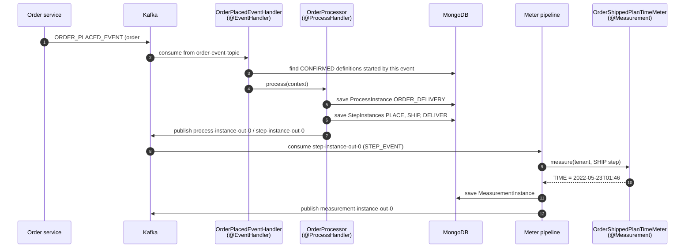

<p align="center">
  
</p>

<p align="center">
  <a href="#quick-start"></a>
  <a href="https://spring.io/projects/spring-boot"></a>
  <a href="https://spring.io/projects/spring-cloud-stream"></a>
  <a href="https://kafka.apache.org/"></a>
  <a href="https://www.mongodb.com/"></a>
  <a href="./LICENSE"></a>
  <a href="#project-status--roadmap"></a>
</p>

<p align="center">
  <b>Aktimetrix</b> turns the business events your systems already emit into a live, queryable picture of every
  running business process — which step each order, loan, or shipment is in, and what should happen next and when.
</p>

<p align="center">
  <a href="#quick-start">Quick start</a> ·
  <a href="#core-concepts">Concepts</a> ·
  <a href="#building-a-monitor-step-by-step">Guide</a> ·
  <a href="#extension-points">Extension points</a> ·
  <a href="https://github.com/arun406/aktimetrix-reference-project-order-monitor">Reference project</a>
</p>

---

## Table of contents

- [Why Aktimetrix?](#why-aktimetrix)
- [Features](#features)
- [How it works](#how-it-works)
- [Core concepts](#core-concepts)
- [Quick start](#quick-start)
- [Building a monitor, step by step](#building-a-monitor-step-by-step)
- [Extension points](#extension-points)
- [Modelling your own process](#modelling-your-own-process)
- [Configuration reference](#configuration-reference)
- [Reference data REST API](#reference-data-rest-api)
- [Project layout](#project-layout)
- [Project status & roadmap](#project-status--roadmap)
- [Contributing](#contributing)
- [License](#license)

## Why Aktimetrix?

Most organizations run long-lived business processes — *order → ship → deliver*, *apply → approve → disburse*,
*book → accept → fly → deliver* — spread across many systems. Each system knows about its own step; nobody sees
the whole journey, and nobody notices a delay until a customer complains.

**Business process monitoring** fixes that by following each business entity through a defined sequence of
milestones and comparing what *should* happen (the plan) with what *does* happen (the actuals).

Aktimetrix is a lightweight Java framework for building those monitors. You describe the process once as reference
data, write a handful of small annotated Spring beans for the domain-specific bits, and Aktimetrix does the rest:

- consumes business events from Kafka,
- creates and persists a **process instance** and its **step instances** for every business entity,
- computes **planned measurements** (for example, "this order should ship by 01:46"),
- publishes every change as an event, so dashboards, alerting, and planning tools can react in real time.

## Features

| | |
|---|---|
| **Declarative process model** | Processes, steps, and measurements are reference data in MongoDB, not code. Change a process without redeploying. |
| **Annotation-driven extension** | `@EventHandler`, `@ProcessHandler`, `@Measurement`, `@PreProcessor`, `@PostProcessor`. Implement a small abstract class and Aktimetrix wires it in automatically. |
| **Event-driven by design** | Built on Spring Cloud Stream and Apache Kafka. Every instance created is published to an outbound topic. |
| **Idempotent instance creation** | A process instance is unique per *tenant + process code + entity type + entity id*, so replayed events never duplicate it. |
| **Multi-tenant** | Every definition and instance carries a tenant key, so one deployment can serve several business units or customers. |
| **Pluggable metering** | Meters compute planned values per *(step, measurement)* pair: times, piece counts, weights, anything you can calculate. |
| **Reference data REST API** | CRUD endpoints for process, step, and measurement-type definitions. |
| **Domain agnostic** | E-commerce, banking, air cargo, logistics: if it has milestones, you can monitor it. |

## How it works

<p align="center">
  
</p>

An Aktimetrix application is a Spring Boot service with two internal pipelines:

1. **Processor.** A business event (e.g. `ORDER_PLACED_EVENT`) arrives on the inbound topic. The **event handler**
   registered for its `eventCode` finds every `CONFIRMED` process definition for that tenant whose
   `startEventCodes` contains the event, and hands each one to its **process handler**. The process handler runs
   the pre-processors, creates the process instance and one step instance per step, and runs the post-processors,
   which publish those instances to `process-instance-out-0` and `step-instance-out-0`.
2. **Meter.** Aktimetrix consumes its own step-instance events. For each step it looks up the step definition,
   and for every *planned* (`P`) measurement it calls the matching **meter**. The resulting measurement
   instances are saved and published to `measurement-instance-out-0`.


```mermaid
sequenceDiagram
    autonumber
    participant S as Order service
    participant K as Kafka
    participant EH as OrderPlacedEventHandler<br/>(@EventHandler)
    participant PH as OrderProcessor<br/>(@ProcessHandler)
    participant DB as MongoDB
    participant MP as Meter pipeline
    participant M as OrderShippedPlanTimeMeter<br/>(@Measurement)

    S->>K: ORDER_PLACED_EVENT (order #1234)
    K->>EH: consume from order-event-topic
    EH->>DB: find CONFIRMED definitions started by this event
    EH->>PH: process(context)
    PH->>DB: save ProcessInstance ORDER_DELIVERY#1234
    PH->>DB: save StepInstances PLACE, SHIP, DELIVER
    PH->>K: publish process-instance-out-0 / step-instance-out-0
    K->>MP: consume step-instance-out-0 (STEP_EVENT)
    MP->>M: measure(tenant, SHIP step)
    M-->>MP: TIME = 2022-05-23T01:46
    MP->>DB: save MeasurementInstance
    MP->>K: publish measurement-instance-out-0
```

## Core concepts

<p align="center">
  
</p>

Aktimetrix separates **what a process looks like** (definitions, maintained as reference data) from **what is
happening to one particular business entity** (instances, created at run time).

| Concept | Kind | Description |
|---|---|---|
| **Process** | definition | A named business process, e.g. `ORDER_DELIVERY`. Lists its steps, the event codes that start it, and the entity type it tracks. |
| **Step** | definition | One milestone in the process, e.g. `SHIP`. Lists the measurements to take at that milestone. |
| **Measurement** | definition | *What* to measure at a step (`TIME`, `PCS`, `WT`, …) and whether it is **P**lanned or **A**ctual. |
| **Business entity** | external | The real-world object being tracked: an order, a loan application, an air waybill. Identified by `entityType` + `entityId`. |
| **Process instance** | runtime | One run of a process for one business entity. *ProcessInstance = Process + identifying metadata.* |
| **Step instance** | runtime | One step of one process instance, carrying its own metadata. |
| **Measurement instance** | runtime | A concrete value computed for one step instance, e.g. *SHIP planned TIME = 2022-05-23T01:46*. |
| **Metadata** | runtime | Key/value pairs you attach to process and step instances (order details, customer, location, …) for use by meters and consumers. |

### Example: one order through the process

When `ORDER_PLACED_EVENT` arrives for order `#1234` (placed at `2022-05-22 23:46`), the
[reference project](https://github.com/arun406/aktimetrix-reference-project-order-monitor) creates one
`ORDER_DELIVERY` process instance with three step instances, and its meters compute the plan:

<p align="center">
  
</p>

### Same model, any domain

The concepts do not change from one domain to the next. Only the definitions do.

<table>
  <tr>
    <th width="33%">E-commerce: order delivery</th>
    <th width="33%">Banking: loan account processing</th>
    <th width="33%">Air cargo: shipment transportation</th>
  </tr>
  <tr>
    <td></td>
    <td></td>
    <td></td>
  </tr>
</table>

## Quick start

The quickest way to see Aktimetrix run is the
[**Order Monitor reference project**](https://github.com/arun406/aktimetrix-reference-project-order-monitor).

### Prerequisites

- JDK 11 or newer
- Docker (for local Kafka and MongoDB), or your own Kafka and MongoDB instances
- Git

### 1. Build and install the framework

Aktimetrix is not yet published to Maven Central, so install it into your local Maven repository:

```bash
git clone https://github.com/arun406/aktimetrix.git
cd aktimetrix
./mvnw clean install
```

### 2. Start Kafka and MongoDB

Save this as `docker-compose.yml` in the `aktimetrix` directory and run `docker compose up -d`:

```yaml
services:
  kafka:
    image: apache/kafka:3.7.0      # single-node KRaft broker on localhost:9092
    ports: ["9092:9092"]
  mongo:
    image: mongo:6
    ports: ["27017:27017"]
```

### 3. Load the reference data

```bash
cd ..
git clone https://github.com/arun406/aktimetrix-reference-project-order-monitor.git
cd aktimetrix-reference-project-order-monitor

for c in processDefinitions stepDefinitions eventTypeDefinitions measurementTypeDefinitions; do
  docker compose -f ../aktimetrix/docker-compose.yml exec -T mongo \
    mongoimport --db svm --collection "$c" --jsonArray < "src/main/resources/$c.json"
done
```

### 4. Run the monitor

Point the application at your local services (these override `application.yml`):

```bash
export SPRING_DATA_MONGODB_URI=mongodb://localhost:27017/svm
export SPRING_KAFKA_PROPERTIES_BOOTSTRAP_SERVERS=localhost:9092
export SPRING_KAFKA_PROPERTIES_SECURITY_PROTOCOL=PLAINTEXT
./mvnw spring-boot:run
```

### 5. Send a business event and watch the plan appear

```bash
# publish an ORDER_PLACED_EVENT
docker compose -f ../aktimetrix/docker-compose.yml exec -T kafka \
  /opt/kafka/bin/kafka-console-producer.sh --bootstrap-server localhost:9092 \
  --topic order-event-topic < requests/request1.json

# read the planned measurements
docker compose -f ../aktimetrix/docker-compose.yml exec kafka \
  /opt/kafka/bin/kafka-console-consumer.sh --bootstrap-server localhost:9092 \
  --topic measurement-instance-out-0 --from-beginning
```

Each message on `measurement-instance-out-0` looks like this:

```json
{
  "tenantKey": "AA",
  "eventType": "Measurement_Event",
  "eventCode": "CREATED",
  "eventName": "Measurement Instance Created Event",
  "source": "Meter",
  "entityType": "com.aktimetrix.measurement.instance",
  "entity": {
    "tenant": "AA",
    "stepCode": "SHIP",
    "code": "TIME",
    "value": "2022-05-23T01:46",
    "unit": "TIMESTAMP",
    "type": "P",
    "processInstanceId": "62a1…",
    "stepInstanceId": "62a1…"
  }
}
```

## Building a monitor, step by step

This section rebuilds the order monitor from scratch. You need three pieces of code: an **event handler**, a
**process handler**, and one **meter** per planned measurement.

### 1. Add the dependency

```xml
<dependency>
    <groupId>com.aktimetrix</groupId>
    <artifactId>aktimetrix-core</artifactId>
    <version>0.0.1-SNAPSHOT</version>
</dependency>
```

### 2. Scan the Aktimetrix components

```java
@SpringBootApplication
@ComponentScan(basePackages = {"com.example.ordermonitor", "com.aktimetrix.core"})
public class OrderMonitorApplication {
    public static void main(String[] args) {
        SpringApplication.run(OrderMonitorApplication.class, args);
    }
}
```

### 3. Describe the process as reference data

A process definition ties the process to the events that start it and the steps it contains:

```json
{
  "tenant": "AA",
  "processCode": "ORDER_DELIVERY",
  "processName": "Order Delivery process",
  "categoryCode": "ORDER",
  "subCategoryCode": "DELIVERY",
  "entityType": "com.ecom.order",
  "startEventCodes": ["ORDER_PLACED_EVENT"],
  "status": "CONFIRMED",
  "steps": [ { "stepCode": "PLACE" }, { "stepCode": "SHIP" }, { "stepCode": "DELIVER" } ]
}
```

Each step definition declares what should be measured at that step (`P` = planned, `A` = actual):

```json
{
  "tenant": "AA",
  "stepCode": "SHIP",
  "stepName": "Order Shipped Step",
  "status": "CONFIRMED",
  "startEventCodes": ["ORDER_SHIPPED_EVENT"],
  "measurements": [ { "measurementCode": "TIME", "type": "P" } ]
}
```

### 4. Handle the triggering event

An event handler receives every event whose `eventCode` matches `eventType`. The built-in
`AbstractEventHandler` resolves the matching process definitions and dispatches to their process handlers, so
most handlers are one line:

```java
@Component
@EventHandler(eventType = "ORDER_PLACED_EVENT")
public class OrderPlacedEventHandler extends AbstractEventHandler {
}
```

Inbound events use the standard Aktimetrix envelope. Your domain object goes in `entity`:

```json
{
  "tenantKey": "AA",
  "eventId": "51541182-81fa-4727-afd5-114acdf086b1",
  "eventType": "ORDER",
  "eventCode": "ORDER_PLACED_EVENT",
  "eventName": "order placed event",
  "eventTime": "2015-11-18T00:00:00.000+0200",
  "eventUTCTime": "2015-11-18 00:00:00",
  "source": "AA",
  "entityId": "1234",
  "entityType": "com.ecom.order",
  "entity": {
    "orderId": "1234",
    "orderedOn": "2022-05-22 23:46:00",
    "customerId": "1",
    "orderTotal": 100,
    "orderCurrency": "USD"
  },
  "eventDetails": {}
}
```

### 5. Create the process handler

The process handler's `processType` must equal the definition's `processCode`. Extend `AbstractProcessor` and
decide which metadata to keep on the process instance and on each step instance:

```java
@Component
@ProcessHandler(processType = "ORDER_DELIVERY")
public class OrderProcessor extends AbstractProcessor {

    private static final DateTimeFormatter IN = DateTimeFormatter.ofPattern("yyyy-MM-dd HH:mm:ss");

    @Override
    protected Map<String, Object> getProcessMetadata(Context context) {
        // keep the whole order on the process instance
        return (Map<String, Object>) context.getProperty(Constants.ENTITY);
    }

    @Override
    protected Map<String, Object> getStepMetadata(Context context) {
        Map<String, Object> order = (Map<String, Object>) context.getProperty(Constants.ENTITY);
        Map<String, Object> metadata = new HashMap<>();
        metadata.put("orderId", order.get("orderId"));
        metadata.put("orderedOn", LocalDateTime.parse((String) order.get("orderedOn"), IN));
        return metadata;
    }
}
```

### 6. Write the meters

A meter computes one measurement for one step. `@Measurement(code, stepCode)` must match a
`measurementCode` in that step's definition:

```java
@Component
@Measurement(code = "TIME", stepCode = "SHIP")
public class OrderShippedPlanTimeMeter extends AbstractMeter {

    @Override
    protected String getMeasurementUnit(String tenant, StepInstance step) {
        return "TIMESTAMP";
    }

    @Override
    protected String getMeasurementValue(String tenant, StepInstance step) {
        // orders should ship within 2 hours of being placed
        LocalDateTime orderedOn = LocalDateTime.parse((String) step.getMetadata().get("orderedOn"));
        return String.valueOf(orderedOn.plusHours(2));
    }
}
```

```java
@Component
@Measurement(code = "TIME", stepCode = "DELIVER")
public class OrderDeliveredPlanTimeMeter extends AbstractMeter {

    @Override
    protected String getMeasurementUnit(String tenant, StepInstance step) {
        return "TIMESTAMP";
    }

    @Override
    protected String getMeasurementValue(String tenant, StepInstance step) {
        // and be delivered within 10 hours
        LocalDateTime orderedOn = LocalDateTime.parse((String) step.getMetadata().get("orderedOn"));
        return String.valueOf(orderedOn.plusHours(10));
    }
}
```

That's the whole monitor: three small classes and some JSON.

## Extension points

Every extension is a Spring bean with a stereotype annotation. Aktimetrix discovers it at startup and registers it
in its internal registry.

| Annotation | Implement / extend | Selected by | Purpose |
|---|---|---|---|
| `@EventHandler(eventType)` | `AbstractEventHandler` or `api.EventHandler` | event's `eventCode` | Entry point for a business event. |
| `@ProcessHandler(processType)` | `AbstractProcessor` or `api.Processor` | definition's `processCode` | Creates process and step instances. |
| `@Measurement(code, stepCode)` | `AbstractMeter` or `meter.api.Meter` | step code + measurement code | Computes a planned measurement value. |
| `@PreProcessor(code, processType, priority)` | `api.PreProcessor` | process type | Runs before instances are created: validate, enrich, filter. |
| `@PostProcessor(code, processType, priority)` | `api.PostProcessor` | process type | Runs after instances are created: publish, notify, integrate. |
| `@Loggable` | any bean exposing an interface | n/a | Logs entry, exit, and execution time of its methods. |

### Example: enrich the context before processing

```java
@Component
@PreProcessor(code = "CUSTOMER_TIER", processType = "ORDER_DELIVERY")
public class CustomerTierPreProcessor implements com.aktimetrix.core.api.PreProcessor {

    private final CustomerClient customers;

    public CustomerTierPreProcessor(CustomerClient customers) {
        this.customers = customers;
    }

    @Override
    public void preProcess(Context context) {
        Map<String, Object> order = (Map<String, Object>) context.getProperty(Constants.ENTITY);
        order.put("customerTier", customers.tierOf((String) order.get("customerId")));
    }
}
```

> Pre-processors are matched on the definition's `processType` field, so add `"processType": "ORDER_DELIVERY"`
> to the process definition when you use them.

### Example: react to newly computed measurements

Measurement post-processors run in the meter pipeline under the `METERPROCESSOR` process type, next to the
built-in `MI_PUBLISHER`:

```java
@Slf4j
@Component
@PostProcessor(code = "LATE_DELIVERY_ALERT", processType = "METERPROCESSOR")
public class LateDeliveryAlert implements com.aktimetrix.core.api.PostProcessor {

    private static final LocalTime CUT_OFF = LocalTime.of(20, 0);

    @Override
    public void postProcess(Context context) {
        context.getMeasurementInstances().stream()
                .filter(m -> "DELIVER".equals(m.getStepCode()) && "TIME".equals(m.getCode()))
                .filter(m -> LocalDateTime.parse(m.getValue()).toLocalTime().isAfter(CUT_OFF))
                .forEach(m -> log.warn("Delivery planned after cut-off: {}", m));
    }
}
```

### Built-in components

| Component | Type | Role |
|---|---|---|
| `ProcessInstancePublisherService` (`PI_PUBLISHER`) | post-processor | Publishes process instances to `process-instance-out-0`. |
| `StepInstancePublisherService` (`SI_PUBLISHER`) | post-processor | Publishes step instances to `step-instance-out-0`. |
| `StepEventHandler` (`STEP_EVENT`) | event handler | Feeds step-instance events into the meter pipeline. |
| `DefaultMeasurementProcessor` (`METERPROCESSOR`) | process handler | Runs the meters for each planned measurement of a step. |
| `MeasurementInstancePublisherService` (`MI_PUBLISHER`) | post-processor | Publishes measurement instances to `measurement-instance-out-0`. |

## Modelling your own process

Monitoring a new domain mostly means writing new reference data. A loan-origination process might look like this:

```json
{
  "tenant": "BANK01",
  "processCode": "LOAN_ORIGINATION",
  "processName": "Retail loan origination",
  "entityType": "com.bank.loan.application",
  "startEventCodes": ["LOAN_APPLICATION_SUBMITTED"],
  "status": "CONFIRMED",
  "steps": [
    { "stepCode": "KYC" },
    { "stepCode": "CREDIT_CHECK" },
    { "stepCode": "APPROVAL" },
    { "stepCode": "DISBURSEMENT" }
  ]
}
```

Then add:

1. an `@EventHandler(eventType = "LOAN_APPLICATION_SUBMITTED")`,
2. an `@ProcessHandler(processType = "LOAN_ORIGINATION")` that copies the applicant and product details into
   metadata,
3. one `@Measurement` meter per planned value, for example `@Measurement(code = "TIME", stepCode = "APPROVAL")`
   returning *submitted + 48 business hours*.

## Configuration reference

Aktimetrix uses standard Spring Boot, Spring Data MongoDB, and Spring Cloud Stream properties. A minimal
`application.yml`:

```yaml
spring:
  data:
    mongodb:
      uri: ${MONGODB_URI:mongodb://localhost:27017/svm}
  jackson:
    serialization:
      write-dates-as-timestamps: false
  kafka:
    properties:
      bootstrap.servers: ${KAFKA_BOOTSTRAP_SERVERS:localhost:9092}
  cloud:
    stream:
      function:
        definition: processor;measure            # the two Aktimetrix pipelines
        bindings:
          processor-in-0: event-processor
          measure-in-0: step-event-processor
      bindings:
        event-processor:
          destination: order-event-topic        # your inbound business events
          group: processor.group.0
        step-event-processor:
          destination: step-instance-out-0      # Aktimetrix's own step events
          group: step.group.0
      source: process-instance;step-instance;measurement-instance
      kafka:
        bindings:
          process-instance-out-0:
            producer:
              configuration:
                "[key.serializer]": org.apache.kafka.common.serialization.StringSerializer
          step-instance-out-0:
            producer:
              configuration:
                "[key.serializer]": org.apache.kafka.common.serialization.StringSerializer
          measurement-instance-out-0:
            producer:
              configuration:
                "[key.serializer]": org.apache.kafka.common.serialization.StringSerializer
          step-event-processor:
            consumer:
              enableDlq: true
              dlqName: input-topic-dlq
logging:
  level:
    com.aktimetrix: DEBUG
```

| Binding | Direction | Payload |
|---|---|---|
| `processor-in-0` | in | Business events (`Event<entity, details>`), routed by `eventCode`. |
| `measure-in-0` | in | Step-instance events (normally bound to `step-instance-out-0`). |
| `process-instance-out-0` | out | `Process_Event` / `CREATED`, keyed by process instance id. |
| `step-instance-out-0` | out | `Step_Event` / `CREATED`, keyed by step instance id. |
| `measurement-instance-out-0` | out | `Measurement_Event` / `CREATED`, keyed by measurement instance id. |

> **Using Confluent Cloud or another secured cluster?** Add `security.protocol`, `sasl.mechanism`, and
> `sasl.jaas.config` under `spring.kafka.properties`, and supply the credentials through environment variables
> or a secret store. Never commit them to source control.

### MongoDB collections

| Collection | Contents |
|---|---|
| `processDefinitions`, `stepDefinitions`, `eventTypeDefinitions`, `measurementTypeDefinitions` | Reference data |
| `processInstances`, `stepInstances`, `measurement-instance` | Runtime state |

## Reference data REST API

| Method | Path | Description |
|---|---|---|
| `GET` / `POST` | `/reference-data/process-definitions` | List or create process definitions |
| `GET` / `POST` | `/reference-data/step-definitions` | List or create step definitions |
| `GET` / `POST` | `/reference-data/measurement-type-definitions` | List or create measurement types |

```bash
curl -X POST http://localhost:8080/reference-data/step-definitions \
  -H 'Content-Type: application/json' \
  -d '{"tenant":"AA","stepCode":"SHIP","stepName":"Order Shipped Step","status":"CONFIRMED",
       "measurements":[{"measurementCode":"TIME","type":"P"}]}'
```

## Project layout

```
aktimetrix/
├── aktimetrix-core/                 # the framework
│   └── src/main/java/com/aktimetrix/core/
│       ├── api/                     # public interfaces: Processor, EventHandler, Context, Registry, …
│       ├── stereotypes/             # @EventHandler, @ProcessHandler, @Measurement, @PreProcessor, …
│       ├── event/handler/           # AbstractEventHandler, built-in StepEventHandler
│       ├── impl/                    # AbstractProcessor, DefaultRegistry, event generators
│       ├── meter/                   # Meter API and AbstractMeter
│       ├── service/                 # instance services, publishers, DefaultMeasurementProcessor
│       ├── referencedata/           # definition models, repositories, REST resources
│       ├── postbeanprocessors/      # annotation scanning → registry
│       ├── configurations/          # Kafka consumers, MongoDB configuration
│       └── model/ · transferobjects/
├── img/                             # documentation images
└── pom.xml
```

## Project status & roadmap

Aktimetrix is **alpha** software (`0.0.1-SNAPSHOT`). The core pipeline (events → process/step instances → planned
measurements) works end to end, as the reference project shows. APIs may still change.

**Planned**

- [ ] **Actual measurements:** capture actuals from milestone events and compute *planned vs. actual* status per step
- [ ] **Planner API:** build and re-plan schedules from process, step, and measurement instances
- [ ] **Notification framework:** alert stakeholders when a step is late or at risk
- [ ] **Spring Boot auto-configuration:** remove the need for `@ComponentScan("com.aktimetrix.core")`
- [ ] **Maven Central release**
- [ ] Post-processors selected by the definition's process type (currently fixed to `A2ATRANSPORT` in `AbstractProcessor`)
- [ ] `@RequestBody` binding for `POST /reference-data/process-definitions` (use `mongoimport` until then)
- [ ] Test suite and CI

## Contributing

Contributions are welcome, whether bug reports, documentation, or code.

1. Fork the repository and create a feature branch from `develop`.
2. Build and verify locally with `./mvnw clean verify`.
3. Keep changes focused and match the surrounding code style.
4. Open a pull request against `develop` that describes the problem and your solution.

For larger changes, please open an issue first so the design can be discussed.

## Tech stack

[Java 11](https://openjdk.org/) ·
[Spring Boot](https://spring.io/projects/spring-boot) ·
[Spring Cloud Stream](https://spring.io/projects/spring-cloud-stream) ·
[Apache Kafka](https://kafka.apache.org/) ·
[MongoDB](https://www.mongodb.com/) ·
[Maven](https://maven.apache.org/) ·
[Lombok](https://projectlombok.org/)

## License

Aktimetrix is open source software released under the [MIT License](./LICENSE).

<p align="center"><sub>Built by <a href="https://github.com/arun406">Arun Kumar Kandakatla</a> and contributors.</sub></p>
