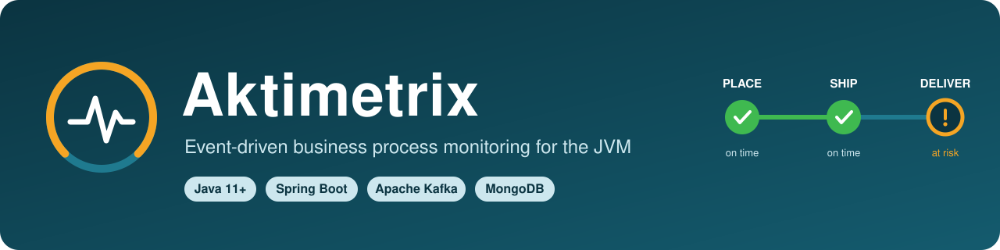

<p align="center">
  
</p>

<p align="center">
  <a href="https://github.com/arun406/aktimetrix/actions/workflows/ci.yml"></a>
  <a href="#modules"></a>
  <a href="./LICENSE"></a>
  <a href="./CHANGELOG.md"></a>
</p>

<h1 align="center">Aktimetrix</h1>

<p align="center">
  <b>An open-source engine for plan-versus-actual monitoring of long-running business processes, in any dimension, derived from the events your systems already emit.</b><br>
  <sub>Open-source library · <a href="./docs/white-paper.md">white paper</a> · <a href="https://github.com/arun406/aktimetrix-reference-project-order-monitor">reference application</a></sub>
</p>

<p align="center">
  <a href="#in-60-seconds">Overview</a> ·
  <a href="#where-it-fits">Where it fits</a> ·
  <a href="#quick-start">Quick start</a> ·
  <a href="#use-it-in-your-application">Use it</a> ·
  <a href="#focus-air-cargo">Air cargo</a> ·
  <a href="#documentation">Docs</a> ·
  <a href="#status-and-roadmap">Roadmap</a>
</p>

---

## In 60 seconds

**The problem.** A business process such as *order → pay → hand over → deliver* runs across many systems. Each
records its own step, none sees the whole journey, and a broken promise is usually found by the customer first.

**What Aktimetrix does.** You declare the process once. For every entity, such as order 1234, it plans each step
and each measurement (time, distance, cost, temperature, rating), sets an alarm at every deadline, and compares every
event that arrives with its plan: on time, late, at risk or overdue, and by how much. It only listens to the events
your systems already emit; nothing is replaced.

<p align="center">
  
</p>

**Three hard problems it solves**

1. **Deadlines that survive crashes, at scale.** Every deadline is a durable alarm in the database, claimed in leased
   batches by any running instance, so no deadline is lost on a restart and none is handled twice
   ([§4](./docs/white-paper.md#4-execution-semantics), [§5.3](./docs/white-paper.md#53-runtime-architecture)).
2. **Never publishing a change that was not saved.** State and outgoing events are written in one transaction and
   relayed afterwards (the transactional outbox), with optimistic locking so instances need no coordination
   ([§6](./docs/white-paper.md#6-reliability-and-consistency)).
3. **One engine, any infrastructure.** The core depends on neither a broker nor a database: Kafka or RabbitMQ,
   MongoDB, PostgreSQL or in memory are interchangeable modules that pass the same contract tests
   ([§5.2](./docs/white-paper.md#52-infrastructure-contract), [§9.1](./docs/white-paper.md#91-technology-bindings)).

**Status.** Java 17+ and Spring Boot 4.1, tested on JDK 17, 21 and 25; first release [0.1.0](./CHANGELOG.md). Unlike a BPMN engine, it
runs no process: it watches the ones your systems already run ([§10.2](./docs/white-paper.md#102-compared-with-bpmn)). The model behind it is described in the
[white paper](./docs/white-paper.md).

## Where it fits

Any entity that passes through milestones reported by events, where the business has expectations about when they
happen and what they measure:

| Domain | Entity | Milestones |
|---|---|---|
| E-commerce | Order | created → paid → handed over → delivered → rated |
| Air cargo | Air waybill | booked → accepted → departed → arrived → delivered |
| Retail banking | Loan application | submitted → KYC → credit check → approved → disbursed |
| Customer service | Ticket | opened → acknowledged → resolved |

**What it is not.**

- **Not a workflow engine.** It observes a process; it never drives one or calls back into source systems.
- **Not process mining.** It follows each entity live against its plan, rather than analysing history in bulk.
- **Not application monitoring.** It watches business commitments, not hosts, requests or traces.
- **Not a user interface.** Aktimetrix is a headless engine. Its results are a query API, published events and
  Micrometer metrics, so they appear in the dashboards, alerting and ticketing tools you already run, such as Grafana.

It combines with all of them; see [positioning](./docs/white-paper.md#10-positioning-and-limitations).

## Quick start

The [Order Monitor](https://github.com/arun406/aktimetrix-reference-project-order-monitor) reference application runs
the order from the animation above end to end. It needs **JDK 17+** and **Docker**.

```bash
git clone https://github.com/arun406/aktimetrix.git
(cd aktimetrix && ./mvnw install -DskipTests)      # until the release is on Maven Central

git clone https://github.com/arun406/aktimetrix-reference-project-order-monitor.git
cd aktimetrix-reference-project-order-monitor
docker compose up -d                               # local message broker and state store
./mvnw spring-boot:run
```

Then send the sample events for order `1234`, as the reference project's README shows, and ask where it stands:

```bash
curl -s 'http://localhost:8080/process-instances?tenant=AA&entityId=1234'
```

## Use it in your application

Add the core, one state store and one message broker:

```xml
<dependency>
    <groupId>com.aktimetrix</groupId>
    <artifactId>aktimetrix-core</artifactId>
    <version>0.2.0-SNAPSHOT</version>
</dependency>
<dependency>
    <groupId>com.aktimetrix</groupId>
    <artifactId>aktimetrix-store-mongodb</artifactId>   <!-- or aktimetrix-store-jdbc, aktimetrix-store-memory -->
    <version>0.2.0-SNAPSHOT</version>
</dependency>
<dependency>
    <groupId>com.aktimetrix</groupId>
    <artifactId>aktimetrix-broker-kafka</artifactId>    <!-- or aktimetrix-broker-rabbitmq -->
    <version>0.2.0-SNAPSHOT</version>
</dependency>
```

Declare the process once, in Java or in a YAML file checked strictly at startup:

```java
@Bean
Definitions orderDelivery() {
    return Definitions.tenant("AA")
            .process("ORDER_DELIVERY", order -> order
                    .entityType("com.ecom.order")
                    .startsOn("ORDER_CREATED_EVENT")
                    .step("ACCEPT", step -> step
                            .on("COURIER_ACCEPTED_EVENT").within("PT1H"))
                    .step("TRAVEL", step -> step
                            .startsOn("TRAVEL_STARTED_EVENT").endsOn("ARRIVED_EVENT")
                            .after("ACCEPT").within("PT30M")
                            .measure("DISTANCE", "route.distanceKm", km -> km.value(5).unit("KM")
                                    .tolerance("20%").worseWhenHigher()))
                    .step("DELIVERED", step -> step
                            .on("DELIVERED_EVENT")
                            .planTime(d -> metadataTime(d, "createdAt").plusDays(2))))   // a rule
            .build();
}
```

Add `aktimetrix-rest` as well for the REST API: where each entity stands, and the definitions. It describes itself
at `/v3/api-docs/aktimetrix`, and in Swagger UI once you add `springdoc-openapi-starter-webmvc-ui`.

Name the inbound topic (`aktimetrix.events.topic`) and the usual Spring Boot connection settings of your broker and
store. The [getting-started guide](./docs/getting-started.md) builds a complete monitor step by step.

## Modules

| Module | Role | Binds to |
|---|---|---|
| `aktimetrix-core` | The runtime, independent of any broker or store | Java 17+, Spring Boot 4.1, Micrometer |
| `aktimetrix-store-mongodb` | State store | MongoDB; atomic on replica sets and sharded clusters |
| `aktimetrix-store-jdbc` | State store | A relational database through JDBC, written for PostgreSQL |
| `aktimetrix-store-memory` | State store | Memory: for tests and demos, not durable |
| `aktimetrix-broker-kafka` | Message broker | Apache Kafka |
| `aktimetrix-broker-rabbitmq` | Message broker | RabbitMQ |
| `aktimetrix-rest` | REST API, optional | Spring MVC; describes itself with OpenAPI (springdoc) |

Every store passes the same contract tests; a new store or broker is a module of its own
([extending](./docs/extending.md)).

## Focus: air cargo

Aktimetrix grew out of air cargo, where plan versus actual for each shipment is already an industry practice. The
Cargo iQ programme of IATA plans a route map of milestones for every shipment and measures carriers, handlers and
forwarders against it. The data already flows as status messages, such as Cargo-IMP FSU and Cargo-XML, for booking,
acceptance, departure, arrival and delivery.

That maps directly onto the model:

| Air cargo | Aktimetrix |
|---|---|
| Air waybill | Business entity |
| Route map with planned milestone times | Process with a plan for each step |
| Status message (e.g. FSU `RCS`, `DEP`, `ARR`, `DLV`) | Business event, translated by an event mapper |
| Milestone missed or late against the plan | Step `OVERDUE`, `AT_RISK` or `LATE`, published at once |
| Weight, pieces, temperature of the goods | Measurements with plans and tolerances |

The difference is that Aktimetrix does it live, for each shipment, on any system that can emit the messages, instead
of in reports after the fact. The e-commerce example is the reference application because it needs no domain
knowledge; an air-cargo example is on the [roadmap](#status-and-roadmap).

**Looking for design partners.** If you run cargo operations as an airline, ground handler or forwarder and want to
try it on your own status messages, please [open an issue](https://github.com/arun406/aktimetrix/issues) or contact
the author. Aktimetrix is independent and not affiliated with IATA or Cargo iQ.

## Documentation

| Document | Contents |
|---|---|
| [White paper](./docs/white-paper.md) | The model, its execution semantics, architecture, reliability guarantees, positioning and limitations; technology-neutral |
| [Core concepts](./docs/concepts.md) | The model in detail, with examples from banking and air cargo |
| [Getting started](./docs/getting-started.md) | Running the example; building a monitor; the event format |
| [Architecture](./docs/architecture.md) | The internal components and the flow of an event through them |
| [Extending Aktimetrix](./docs/extending.md) | Meters, event mappers, handlers, new stores and brokers |
| [Configuration and API reference](./docs/configuration.md) | Properties, channels, storage, metrics and REST endpoints |
| [Changelog](./CHANGELOG.md) · [Releasing](./RELEASING.md) | Release history, and how a release is made |

## Status and roadmap

**In development: 0.2.0.** Java 17+ and Spring Boot 4.1, tested on JDK 17, 21 and 25, on embedded brokers and
databases; the REST API is a module of its own, with an OpenAPI description. The first release, **0.1.0**, runs on
Java 11+ and Spring Boot 2.7. The public API may still change before 1.0; the [known limitations](./docs/white-paper.md#103-known-limitations) are listed in the white paper.

Next:

- **Maven Central.** Publish the release so that applications add the dependencies without building from source.
- **Air-cargo example.** A second reference application that follows air waybills through a route map from FSU
  status messages.
- **Feedback from real operations.** Run it with a design partner on real event volumes and data quality.

Out of scope: a user interface of its own (see [where it fits](#where-it-fits)).

## Contributing

Contributions are welcome, whether they are bug reports, documentation, new bindings or code.

1. Fork the repository and branch from `develop`.
2. Build and verify with `./mvnw clean verify`.
3. Open a pull request against `develop` that describes the problem and the change.

For larger changes, please open an issue first so the design can be discussed.

## License

Aktimetrix is released under the [Apache License 2.0](./LICENSE).

<p align="center"><sub>Authored by <a href="https://github.com/arun406">Arun Kumar Kandakatla</a> and contributors.</sub></p>
