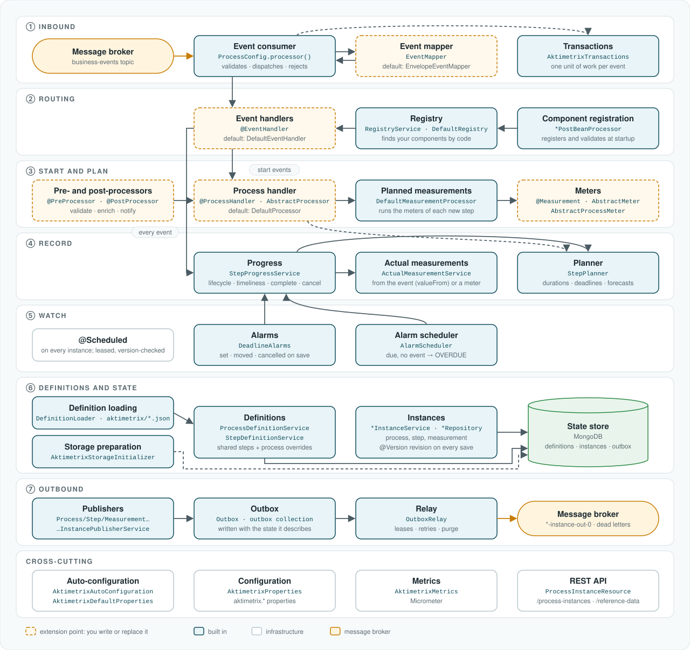

# Architecture

[← Back to README](../README.md)

This page is for contributors, and for anyone adapting Aktimetrix to their own systems. It describes the reference
implementation's internal components: what each does, how an event flows through them, and where to change them.
The [white paper](./white-paper.md) describes the model they implement.

## Components

<p align="center">
  
</p>

The figure groups the components by the stage of an event's path through them. The white paper's
[five layers](./white-paper.md#51-logical-architecture) group the same components by concern: *integration* is stage ①;
*process* is stages ② and ⑤ and the lifecycle part of ④; *measurement* is stage ③'s meters and planning and stage ④'s
actual values, comparison, forecasts and metrics; *model* and *persistence* are stages ⑥ and ⑦. How the stages run on
several instances is described in [Runtime architecture](./white-paper.md#53-runtime-architecture).

Dashed orange boxes are **extension points**: you implement or replace them. Blue boxes are **built in**. The
[public API](extending.md#public-api) lists which types you may use; everything else is internal and may change.

| Stage | Components | Responsibility |
|---|---|---|
| ① Inbound | `ProcessConfig.processor()`, `EventMapper`, `AktimetrixTransactions` | Consume each message, turn it into an event, reject what cannot be processed, and run the rest as one unit of work. |
| ② Routing | `RegistryService`, `DefaultRegistry`, `*PostBeanProcessor`, event handlers | Find the components registered for a code: event handlers by event code, process handlers by process code, meters by step or process and measurement code. |
| ③ Start and plan | `AbstractProcessor`, pre- and post-processors, `DefaultMeasurementProcessor`, meters | Create a process instance and its steps, and compute their planned measurements. |
| ④ Record | `StepProgressService`, `ActualMeasurementService`, `DerivedMetricService`, `StepPlanner` | Advance steps, record actual values and interim readings, judge timeliness, forecast delays, complete, end or cancel processes, and compute their metrics. |
| ⑤ Watch | `DeadlineAlarms`, `AlarmScheduler`; `OverdueStepMonitor`, `OverdueProcessMonitor` | Keep an alarm at each open deadline; fire the alarms that are due, and mark steps and processes still without their event overdue. The monitors are a slower safety-net sweep. |
| ⑥ Definitions and state | `DefinitionLoader`, `ProcessDefinitionService`, `StepDefinitionService`, instance services, and the store contract (`core.store`) implemented by the store module | Load, version and resolve definitions; read and save instances with version checks; prepare the database. |
| ⑦ Outbound | publishers, `Outbox`, `OutboxRelay` | Queue every result with the state it describes, and publish it to the broker. |
| Cross-cutting | `AktimetrixAutoConfiguration`, `AktimetrixDefaultProperties`, `AktimetrixProperties`, `AktimetrixMetrics`, REST resources | Wiring, configuration, metrics and the query API. |

## Flows

### At startup

1. `AktimetrixAutoConfiguration` registers the framework's components in the application, and
   `AktimetrixDefaultProperties` supplies default binding properties, which the application can override.
2. The `*PostBeanProcessor`s find every bean annotated `@EventHandler`, `@ProcessHandler`, `@Measurement`,
   `@PreProcessor` or `@PostProcessor` and register it in `DefaultRegistry` under its codes. A misconfigured meter,
   for example one naming both a step and a process, stops the application here.
3. Before any event is consumed:
   - the store module prepares its database before the stores are first used: the MongoDB store upgrades data
     saved by earlier versions and creates its indexes, the JDBC store creates its tables;
   - `DefinitionLoader` registers the planning rules of `Definitions` beans (the Java DSL) as meters, each limited
     to its tenant and process; reads the process and step definitions from `aktimetrix/*.json`, `aktimetrix/*.yaml`
     and those beans, rejecting unknown fields; validates them all, failing with every problem found; and upserts
     them. A process definition that changed gets a new revision.

### When an event arrives

1. **Consume.** `ProcessConfig.processor()` receives the message and asks the `EventMapper` for an event. A message the
   mapper cannot read, or an event without tenant, event code or entity id, goes to the dead-letter topic through the
   outbox; one it returns `null` for is ignored.
2. **Unit of work.** The rest runs in `AktimetrixTransactions.run(…)`, which the store module implements: in one
   transaction when the store supports it. If anything fails, nothing is kept, and the binder retries the message, then dead-letters it.
3. **Route.** The registry supplies the `@EventHandler` for the event code, or `DefaultEventHandler`.
4. **Start** (`AbstractEventHandler`). For every confirmed process definition the event code starts,
   `ProcessDefinitionService` resolves its steps: the tenant's shared step definitions, overridden by the fields the
   process sets. The registry supplies the process's `@ProcessHandler`, or `DefaultProcessor`, which (`AbstractProcessor`):
   1. runs the pre-processors of the process type;
   2. creates the process instance, with its own deadline if it has one, and its step instances, unless the entity
      already has one;
   3. runs the process-level meters, then, per step, `DefaultMeasurementProcessor` runs the step's meters and turns a
      planned `TIME` into `plannedAt`;
   4. `StepPlanner` plans the steps that have durations, and sets every deadline (`lateAfter`);
   5. runs the post-processors, the built-in publishers last, which queue the `CREATED` process and step events.
5. **Record** (`StepProgressService.recordMilestones`). For each running process of the entity:
   - if the event is one of the process's cancel events, the process and its open steps are cancelled;
   - otherwise each step that lists the event is started or completed. A completed step gets its actual `TIME`, its
     other actual measurements from `ActualMeasurementService`, and its timeliness. `StepPlanner` then plans the steps
     that follow it and forecasts the later ones; those pushed past their deadline become `AT_RISK`, and those already
     at risk are published again with their later forecast;
   - an open step that lists the event among its progress events gets interim readings from `ActualMeasurementService`;
   - when the last mandatory step completes, or one of the process's end events arrives, the process completes, is
     judged against its own deadline, records its actual measurements, and `DerivedMetricService` computes its metrics.

   Every change is saved and its event queued in the outbox.
6. **Commit.** The transaction commits: state and queued events together.

### When a deadline passes

Whenever a step or process instance is saved, `DeadlineAlarms` keeps its alarm in line with its deadline
(`lateAfter`), in the same unit of work: it sets one when the instance is planned, moves it when a forecast or re-plan
moves the deadline, and cancels it when the instance completes, is cancelled or becomes overdue. The instance records
the due time of its alarm, so a save that does not move the deadline writes nothing more. There is at most one alarm
per step or process, identified by it.

Every 5 seconds, on every instance, `AlarmScheduler` claims the alarms that are due, oldest first, in batches of 100,
with an atomic conditional update that sets a lease, so each alarm is fired by one instance. For each, in its own
transaction, it reads the step or process again: if its event has arrived, the alarm is dropped; if its deadline has
moved later, the alarm is set again; otherwise it is marked `OVERDUE`, with an `OVERDUE` event queued, and, for a step,
the later steps are forecast. Saves are version-checked: if the step's event changed it meanwhile, the save fails and
the alarm fires again when its lease expires, and then finds it settled. Firing costs one indexed query for the due
alarms, however many entities are watched.

Every 10 minutes, `OverdueStepMonitor` and `OverdueProcessMonitor` sweep for steps and processes past their deadline
and not yet overdue, and mark them the same way: a safety net for any deadline without an alarm, such as those of
instances saved before alarms existed.

### When results are published

`OutboxRelay` runs every second on every instance. It claims the oldest unsent outbox entry with an atomic
find-and-modify that sets a lease, sends it with `StreamBridge` to its binding (`process-instance-out-0`,
`step-instance-out-0`, `measurement-instance-out-0` or `dead-letter-out-0`), and marks it sent. An entry whose send fails
keeps its lease until it expires, then any instance retries it. Sent entries are purged after the retention period.

## Concurrency and consistency

| Concern | Mechanism |
|---|---|
| Events of one entity processed in order | The broker's per-key ordering; producers key events by entity id. |
| One process instance per entity | Unique index on tenant, process code, entity type and entity id. |
| Two changes to the same step or process | `@Version revision` on step and process instances: the second save fails instead of overwriting. |
| State and outbound events | One transaction per event, or per alarm fired, when the store supports transactions: MongoDB as a replica set, or a relational database. |
| Outbox and alarms shared by several instances | Leases claimed with an atomic conditional update. |
| Replayed events | A process that exists is not created again, and a completed step is not completed again. |

## Adapting Aktimetrix

| To… | Change | Where |
|---|---|---|
| Accept another event format | Declare an `EventMapper` bean. | Your application; see [Accepting your own event format](extending.md#accepting-your-own-event-format). |
| Change how an event is interpreted | Add an `@EventHandler` for its event code. | Your application. |
| Choose metadata, validate or enrich | Add a `@ProcessHandler`, `@PreProcessor` or `@PostProcessor`. | Your application. |
| Compute plans or actual values | Add a `@Measurement` meter. | Your application. |
| Use another store or broker that has a module | Depend on its module instead: `aktimetrix-store-mongodb`, `-jdbc` or `-memory`; `aktimetrix-broker-kafka` or `-rabbitmq`. | Your application's `pom.xml` |
| Support another message broker | A broker module: the Spring Cloud Stream binder, and an `EnvironmentPostProcessor` with its defaults, which dead-letter failing events to `aktimetrix.events.dead-letter.topic` and map the `aktimetrixKey` header to the broker's message key. | A new module, like `aktimetrix-broker-kafka`; see [Adding a broker](extending.md#adding-a-message-broker) |
| Support another state store | A store module: implementations of the interfaces in `com.aktimetrix.core.store`, and an auto-configuration that declares them. It must pass the store contract tests. | A new module, like `aktimetrix-store-jdbc`; see [Adding a state store](extending.md#adding-a-state-store) |

## Source layout

```
aktimetrix-core/                   the runtime, independent of any broker or store
aktimetrix-store-mongodb/          state store: MongoDB
aktimetrix-store-jdbc/             state store: relational database through JDBC (PostgreSQL)
aktimetrix-store-memory/           state store: in memory, for tests and demos
aktimetrix-broker-kafka/           message broker: Apache Kafka
aktimetrix-broker-rabbitmq/        message broker: RabbitMQ
aktimetrix-rest/                   the REST API, described with OpenAPI
aktimetrix-tests/                  store contract tests, and end-to-end tests of every store with every broker

aktimetrix-core/src/main/java/com/aktimetrix/
├── autoconfigure/             auto-configuration and default properties
└── core/
    ├── api/                   public interfaces: EventMapper, Pre/PostProcessor, Context, Timeliness …
    ├── stereotypes/           @Measurement, @ProcessHandler, @EventHandler, @PreProcessor, @PostProcessor
    ├── meter/                 Meter, ProcessMeter and their base classes
    ├── event/                 the default event mapper, and event handlers
    ├── impl/                  AbstractProcessor, DefaultProcessor, the registry, event generators
    ├── model/                 process, step and measurement instances
    ├── referencedata/         definitions: model, loading, validation, versioning, resolution
    ├── service/               progress, planning, actual measurements, monitors, publishers, metrics
    ├── outbox/                the outbox and its relay
    ├── store/                 the state-store contract, which store modules implement
    ├── configurations/        aktimetrix.* properties and the inbound consumer
    └── transferobjects/       the event envelope and outbound payloads
```

---

**Next:** [Extending Aktimetrix](extending.md)
