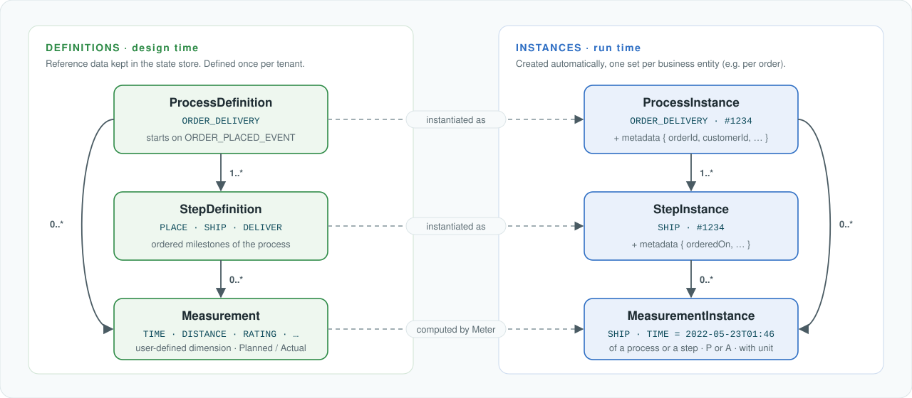
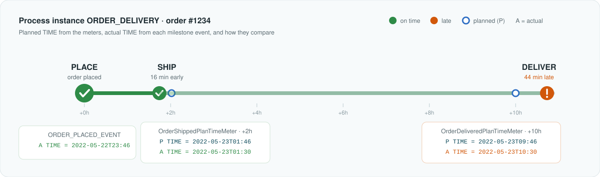
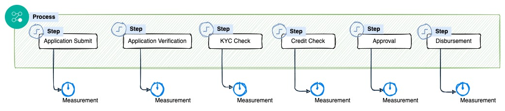
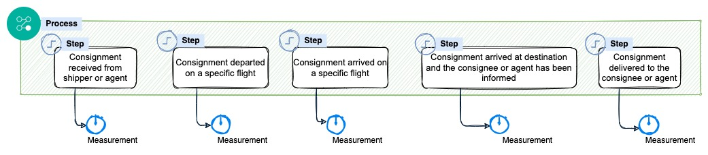

# Core concepts

[← Back to README](../README.md)

  

Aktimetrix separates **what a process looks like** (definitions, maintained as reference data) from **what is
happening to one particular business entity** (instances, created at run time).

| Concept | Kind | Description |
|---|---|---|
| **Process** | definition | A named business process, e.g. `ORDER_DELIVERY`. Lists its steps, the event codes that start it, and the entity type it tracks. |
| **Step** | definition | One milestone in the process, e.g. `SHIP`. Lists the measurements to take at that milestone. |
| **Measurement** | definition | *What* to measure at a step (`TIME`, `PCS`, `WT`, …) and whether it is **P**lanned or **A**ctual. |
| **Business entity** | external | The real-world object being tracked: an order, a loan application, an air waybill. Identified by `entityType` + `entityId`. |
| **Process instance** | runtime | One run of a process for one business entity. *ProcessInstance = Process + identifying metadata.* |
| **Step instance** | runtime | One step of one process instance, carrying its own metadata. |
| **Measurement instance** | runtime | A concrete value computed for one step instance, e.g. *SHIP planned TIME = 2022-05-23T01:46*. |
| **Metadata** | runtime | Key/value pairs you attach to process and step instances (order details, customer, location, …) for use by meters and consumers. |

### Step lifecycle: plan and actual

Every step instance moves through a simple lifecycle, driven by the business events named in its step definition:

| Status | When |
|---|---|
| `Created` | The process instance is created. |
| `Started` | An event in the step's `startEventCodes` arrives, and the step also has `endEventCodes`. |
| `Completed` | An event in the step's `endEventCodes` arrives. A step without end codes is a single milestone and completes on its start event. |

When a step completes, Aktimetrix records an **actual** `TIME` measurement (type `A`) holding the moment the event
happened, next to the **planned** values your meters computed. When every non-optional step (`optionalInd` ≠ `Y`)
is complete, the process instance is marked complete. Replayed events are ignored, so a completed step is never
recorded twice.

### Example: one order through the process

When `ORDER_PLACED_EVENT` arrives for order `#1234` (placed at `2022-05-22 23:46`), the
[reference project](https://github.com/arun406/aktimetrix-reference-project-order-monitor) creates one
`ORDER_DELIVERY` process instance with three step instances, and its meters compute the plan. The start event
completes `PLACE`; when `ORDER_SHIPPED_EVENT` arrives at 01:30, `SHIP` completes with an actual time 16 minutes
ahead of plan:

  

### Same model, any domain

The concepts do not change from one domain to the next. Only the definitions do.

<table>
  <tr>
    <th width="33%">E-commerce: order delivery</th>
    <th width="33%">Banking: loan account processing</th>
    <th width="33%">Air cargo: shipment transportation</th>
  </tr>
  <tr>
    <td></td>
    <td></td>
    <td></td>
  </tr>
</table>

---

**Next:** [Getting started](getting-started.md)
