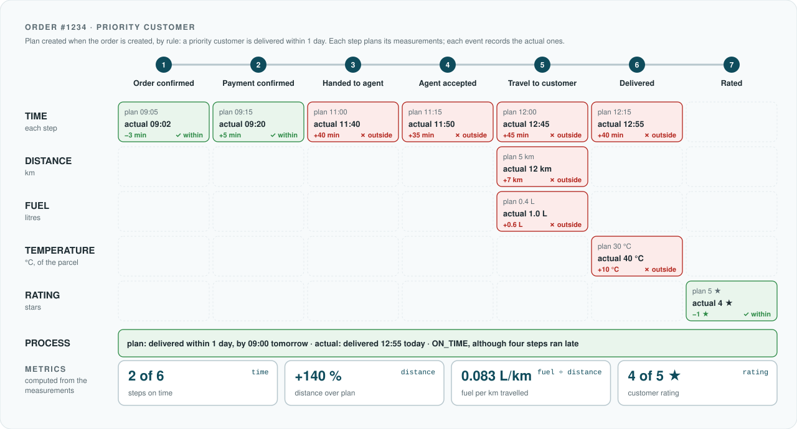
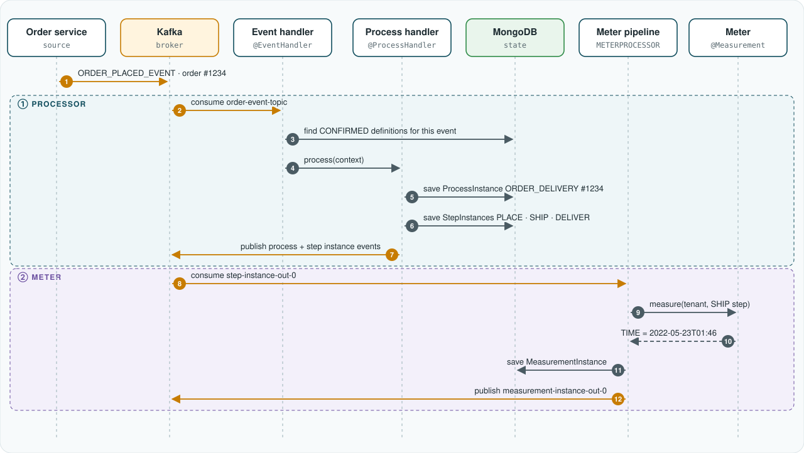
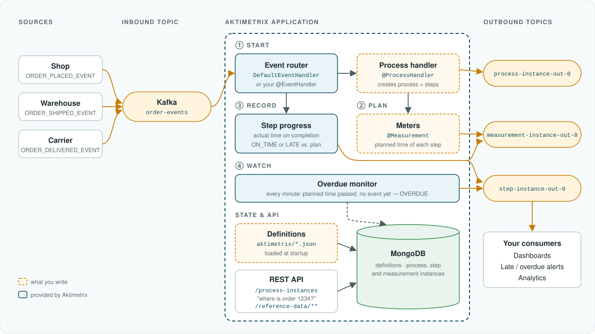
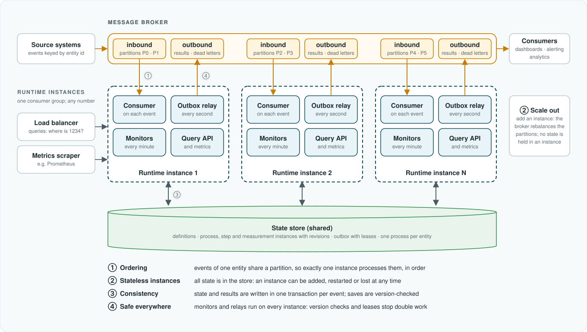

# Aktimetrix: plan-versus-actual monitoring of business processes

[← Back to README](../README.md)

*A white paper. Version 0.1, Arun Kumar Kandakatla.*

The model and its semantics are technology-neutral; section 9 describes the open-source reference implementation in
this repository.

## Abstract

Business processes such as *order → pay → deliver*, *apply → approve → disburse* or *book → accept → fly → deliver*
span many independent systems. Each system records its own step, but no system holds the whole journey, so a
deviation from what was promised is usually discovered by the customer before it is discovered by the business.

**Aktimetrix** is a model and a runtime for closing that gap. A process is declared once as an ordered set of steps,
and each process and step declares the **measurements** that matter to the business: when it happens, but equally the
distance travelled, the fuel consumed, the temperature of the goods or the rating the customer gives. For each
business entity, such as an order, the runtime derives a **plan**, the expected value of every measurement, by rules
such as *priority customers are delivered within one day*. As business events arrive, it records the **actual**
values, compares each with its plan, and reports the deviation and whether it is within tolerance. For time, which
also lets it act before a step happens, it marks steps and processes **on time**, **late**, **at risk** or
**overdue**. The results can be queried ("where is order 1234?"), are published as events of their own, and feed
**metrics** computed from the measurements.

The model depends on only two infrastructure capabilities: a **message broker** that delivers business events, and
a **state store** that holds definitions and running instances. Neither is tied to a particular product. This
document describes the model, its execution semantics and its reliability guarantees in those terms. The
[reference implementation](#9-reference-implementation) is one concrete realisation of it, on the JVM.

## Contents

1. [Introduction](#1-introduction)
2. [Design goals](#2-design-goals)
3. [The monitoring model](#3-the-monitoring-model)
4. [Execution semantics](#4-execution-semantics)
5. [Architecture](#5-architecture)
6. [Reliability and consistency](#6-reliability-and-consistency)
7. [Extensibility](#7-extensibility)
8. [Observability](#8-observability)
9. [Reference implementation](#9-reference-implementation)
10. [Positioning and limitations](#10-positioning-and-limitations)
11. [Further reading](#11-further-reading)

[Appendix A. Glossary](#appendix-a-glossary)

## 1. Introduction

A long-running business process is a sequence of milestones that happen in different systems, often owned by different
teams or organisations. An e-commerce order is created in a shop, paid through a payment provider, handed over by a
warehouse and delivered by a courier. A loan is submitted in a portal, checked by a credit bureau, approved by an
underwriter and disbursed by core banking.

Each of these systems already announces what it did, as a business event. What is missing is the layer that joins
those events into a single account of each entity and compares it with what was supposed to happen. Without it,
organisations rely on batch reports that arrive after the fact, or on bespoke integrations rebuilt for every
process.

**Business process monitoring** provides that layer. It follows each business entity through a defined sequence of
steps and continuously compares the plan with the actuals, in every dimension the business measures. Aktimetrix
treats this as a general, reusable capability: the process is data, the planning rules are configuration or small
pieces of code, and everything else, from event routing to state management, deadline tracking, comparison and
publication of results, is provided by the runtime.

### 1.1 A worked example: order delivery

An order is created: that is a business event, and it starts an **order delivery** process for the order. From the
order, rules derive the **plan**, at two levels:

- for the **order as a whole**, the process instance: this customer is a priority customer, so the order is to be
  delivered within one day, at a cost of €8;
- for **each step**, a step instance: each step has an expected time; the journey to the customer is expected to be
  5 km and to use 0.4 litres of fuel; the parcel is to be delivered at 30 °C at most; the customer is expected to give
  five stars.

The process then runs through its steps, each reported by an event from the system that performs it. Each event
records the **actual** measurements of its step; the event that completes the order also records the order's own:

| Step | Code | Reported by | Measurements |
|---|---|---|---|
| 1. Order confirmed | `CONFIRM` | shop | time |
| 2. Payment confirmed | `PAY` | payment provider | time |
| 3. Handed to the delivery agent | `HANDOVER` | warehouse | time |
| 4. Delivery agent accepted | `ACCEPT` | delivery app | time |
| 5. Travelled to the customer | `TRAVEL` | delivery app | time, distance, fuel |
| 6. Delivered | `DELIVERED` | delivery app | time, temperature of the parcel |
| 7. Rated by the customer (optional) | `RATED` | shop | rating |
| *The order as a whole* | `ORDER_DELIVERY` | *completed by step 6* | *delivery time against the one-day promise, cost* |

<p align="center">
  
</p>

Every actual value is compared with its plan. At step level, the route was 12 km instead of 5, used 1.0 litre
instead of 0.4 and kept the parcel at 40 °C instead of 30, all outside their tolerances; the customer gave four stars
instead of five, within tolerance; four steps ran late. At process level, the order was still delivered well within
its one-day promise, but cost €9.50 instead of €8: the two levels answer different questions. From these
measurements follow the **metrics** a business steers by: per order, such as its fuel per kilometre, and across all
orders, such as the share of steps on time or how far routes run over plan. Time is one measurement among these, with one extra
role: because a plan says *when* a step should happen, the runtime can also raise an alarm while a step is **at risk**
or **overdue**, before anyone has measured anything.

The rest of this paper describes the model behind this example (§3), how the runtime executes it (§4), how it is built
and kept reliable (§5–§6), how an application adapts and observes it (§7–§8), and the reference implementation that
realises it (§9).

## 2. Design goals

| Goal | Consequence in the design |
|---|---|
| **Non-invasive** | Source systems are not changed. They publish the business events they already produce, in their own format; an event mapper translates them, and Aktimetrix only consumes them. |
| **Declarative** | Processes, steps, measurements, fixed plans, durations and tolerances are data, versioned with the application or managed at run time. |
| **Minimal code** | A working monitor needs definitions and, only for plans computed by rules, a meter. Every other component has a default. |
| **Infrastructure-neutral model** | The model assumes only a message broker and a state store with the properties listed in [§5.2](#52-infrastructure-contract). |
| **Reliable** | Results are persisted before they are published; an unavailable broker delays results but does not lose them. |
| **Idempotent** | Replayed or duplicated events do not create duplicate processes or complete a step twice. |
| **Multi-tenant** | Every definition and instance belongs to a tenant; definitions never apply across tenants. |
| **Observable** | The runtime reports its own throughput, and the timeliness and deviations of the processes it monitors, as metrics. |

## 3. The monitoring model

<p align="center">
  
</p>

### 3.1 Definitions and instances

The model separates **what a process looks like** from **what is happening to one business entity**.

| Definition (design time) | Instance (run time, one per business entity) |
|---|---|
| **Process**: a named business process, such as `ORDER_DELIVERY`, the entity type it follows, its steps, and the events that start, end or cancel it | **Process instance**: that process for one entity, such as order `#1234` |
| **Step**: one milestone, such as `DELIVERED`, and the events that start and complete it; shared by the tenant's processes, and adaptable per process | **Step instance**: `DELIVERED` for order `#1234`, with its status, planned and actual time, and timeliness |
| **Measurement**: a user-defined dimension observed at the process or at a step (time, distance, fuel, temperature, rating…), either **P**lanned or **A**ctual | **Measurement instance**: one value for one process or step instance, such as *planned DISTANCE of `TRAVEL` = 5 km*, or *actual DISTANCE = 12 km, 7 km over plan, outside tolerance* |

A **business entity** is the real-world object being followed. It is identified by an entity type and an entity id,
and it is owned by the source systems, not by Aktimetrix.

Definitions are **versioned**. Each change to a process definition is a new revision, and a process instance keeps
the definition it started with, its steps included, until it ends. A change therefore applies to the entities that
start after it, and never alters the plan or the rules of one already under way.

### 3.2 Measurements: plan and actual

A **measurement** is anything about a process that the business plans and observes. Measurement types are defined by
the user, each with a code and a unit: `TIME` (a timestamp), `DISTANCE` (km), `FUEL` (litres), `TEMPERATURE` (°C),
`RATING` (stars), `WEIGHT` (kg), or any other quantity.

- **Level.** A measurement belongs either to a **process instance**, when it describes the entity as a whole (the
  order's delivery deadline, its cost), or to a **step instance**, when it describes one milestone (the time of each
  step, the distance and fuel of the journey, the temperature on delivery, the rating). The two levels are described
  side by side in [§3.3](#33-plans-at-two-levels-process-and-step).
- **Plan.** A **planned** (`P`) value is set when the process instance is created, for the process and each of its
  steps: a fixed value from the definition (a rating of 5), a duration (delivered within one day), or the result of a
  rule written as a **meter** (priority customers within one day, others within three; the route length from the
  address). A step planned relative to another step gets its planned time when that step completes.
- **Actual.** An **actual** (`A`) value is recorded when the step or process completes: read from the event that
  completed it (the distance on the delivery confirmation, the rating on the review) or computed by a meter. The
  actual time of a step is always recorded: it is when its event happened.
- **Readings in progress.** A step that takes time, such as the journey to the customer, can also report
  **interim readings** while it is open, on progress events (*location updated: 8 km so far*). Each is compared with
  the plan at once, so a deviation shows before the step ends; the final actual is recorded when it completes.
- **Comparison.** Each actual value is compared with the planned value of the same measurement: the **deviation**
  is actual minus planned (+7 km), and, when the measurement declares a **tolerance** (2 km, or 20 %), the actual is
  **within** or **outside** tolerance. Plan, actual and comparison are stored and published together.
- **Time, in addition.** A planned time is also a **deadline**. Besides being compared once it happens, a step is
  watched while it has not: it becomes `AT_RISK` when an earlier delay pushes its forecast past its deadline, and
  `OVERDUE` when the deadline passes without its event. A process with a deadline of its own is watched the same way
  ([§4.3](#43-comparing-plan-and-actual)).

**Metrics** are computed from the measurements. A process declares its own, as arithmetic over measurement codes,
such as *fuel per kilometre = FUEL / DISTANCE*: when the process completes, each code stands for the sum of that
measurement's final values across the process and its steps, and the metric is computed from the plan and from the
actuals and compared like any measurement. The runtime also reports metrics for the whole population, such as how
many actuals were within tolerance and the distribution of deviations ([§8](#8-observability)); anything else can
be computed by consumers of the published measurement events.

### 3.3 Plans at two levels: process and step

Every process instance and every step instance has its own plan and its own actuals. They describe different things
and are measured at different moments:

| | Process instance (the order) | Step instance (e.g. *Travel to customer*) |
|---|---|---|
| **Describes** | the entity as a whole, end to end | one milestone of it |
| **Declared in** | the process definition's `measurements`; for time, its `plannedWithin`, or a planned `TIME` computed by a rule | the step definition's `measurements`; for time, its `plannedWithin` / `plannedAfter`, or a planned `TIME` computed by a rule |
| **Plan set** | once, when the process instance is created | when the process instance is created; a step planned after another step, when that step completes |
| **Actual recorded** | when the process completes, from the event that completes it: its last mandatory step (*delivered*), or an explicit end event | when the step completes, from the event that completes it |
| **Time** | the process's own deadline, e.g. *within 1 day*: judged `ON_TIME` or `LATE` at completion, `OVERDUE` if it passes first | the step's planned time: `ON_TIME` or `LATE`, and `AT_RISK` or `OVERDUE` before it happens |
| **Example** | delivered within 1 day; cost €8 | journey of 5 km using 0.4 litres; parcel at 30 °C at most; five-star rating |

The two levels are **independent**. A process-level measurement is not derived from its steps: a late step does not
make the order late (in the example, four steps ran late but the order was on time), and the order's cost is its own
figure. When a value at process level should follow from the steps, declare it as a **metric** of the process: the
order's total distance is `DISTANCE`, the sum over its steps; its fuel per kilometre is `FUEL / DISTANCE`.

Choosing the level follows from *when the value is known*. The order's cost is reported with the delivery, which
completes the order, so it belongs to the process. The customer's rating arrives after the order has completed, so it
belongs to an optional step: a completed process still records its optional steps, but no longer its own actuals.

### 3.4 Metadata

Instances carry **metadata**: key/value pairs taken from the domain, such as an order's id, when it was created and
whether its customer is a priority customer. Metadata is the input to planning (a meter reads the creation time and
the priority to compute the delivery deadline) and travels with
every published result, so consumers do not need to query the source systems.

### 3.5 Business events

Every inbound event uses one envelope, whatever its source. The fields the model depends on are:

| Field | Role |
|---|---|
| `tenantKey` | Selects the tenant's definitions and instances. |
| `eventCode` | Determines which processes the event starts and which steps it starts or completes. |
| `entityType`, `entityId` | Identify the business entity. All events of order `1234` carry `1234`. |
| `eventTime` | When the event happened in the business; it becomes the actual time of the step. |
| `entity` | The domain object, which becomes metadata. |

The full envelope is specified in the [event format](./getting-started.md#the-event-format). Source systems do not
need to adopt it: an **event mapper** translates each system's own messages into this envelope as they are consumed
([§7](#7-extensibility)).

## 4. Execution semantics

The runtime works in four stages: the first three are driven by each business event, the fourth by the clock. The
figures in this section follow order 1234 of §1.1,
which the [reference project](#92-running-the-example) implements.

<p align="center">
  
</p>

1. **Start.** If the event's code is one of a process's start events, a process instance and its step instances
   are created for the entity, unless one already exists. The same event may also complete the first step.
2. **Plan.** The new process and its steps receive their planned measurements; a planned time also sets a
   **deadline**: the planned time plus its tolerance, and an **alarm** at that deadline.
3. **Record.** The event is applied to every process instance of the entity that is not cancelled. Steps that list it
   are started or completed; a completed step records its actual measurements, starting with its time, and each is
   compared with its plan; an event that reports progress records interim readings of the step it concerns. When the
   process completes, implicitly or by an end event, it records its own measurements and computes its metrics.
4. **Watch.** Independently of events, when an alarm fires, the runtime checks whether the event that completes its
   step or process has arrived. If it has not, the step or process is marked `OVERDUE`; when the event arrives
   later, it is compared with the plan as usual, and the deviation says how late it was.

An alarm is set, moved or cancelled whenever its step or process is saved: moved when a forecast or a re-plan moves
the deadline, cancelled when the event arrives in time or the process is cancelled. Alarms are kept in the state store
with an index on their due time, so firing them costs a lookup of the alarms now due, whatever the number of
entities watched; and they survive a restart of the runtime.

### 4.1 Lifecycle

**Start and end of a process.** Both can be implicit or explicit, as the business case requires:

| | Implicit | Explicit |
|---|---|---|
| **Start** | a business event with its own meaning, e.g. *order created*; it can also complete the first step | a dedicated event, e.g. *order fulfilment started*, raised by whichever system decides that monitoring begins |
| **End** | the last mandatory step completes, e.g. *order delivered* | a dedicated event, e.g. *order closed* after the returns window: the process completes on it, whatever its steps |

A process definition lists its start events and, optionally, its end and cancel events. Without end events, a process
ends implicitly. With them, it ends only on one of them; its mandatory steps still open become `Skipped`, and its
optional ones stay open.

| Status | A step enters it when | A process enters it when |
|---|---|---|
| `Created` | the process instance is created | it is created, by one of its start events |
| `Started` | one of the step's start events arrives, and the step also has end events | n/a |
| `Completed` | one of the step's end events arrives; a step with no end events is a single milestone and completes on its start event | implicitly, its last mandatory step completes; or explicitly, one of the process's end events arrives |
| `Skipped` | it is mandatory and still open when its process ends explicitly | n/a |
| `Cancelled` | its process is cancelled before it completed | an event in the process's cancel events arrives, e.g. *order cancelled* |

A cancelled process is no longer monitored: a cancelled order does not leave steps to go overdue. A completed
process still records its optional steps, which may happen later: the customer's rating the day after delivery.

### 4.2 Planning

Planned values are derived when a process instance is created, for the process and for each of its steps:

| Method | Declared as | Planned value |
|---|---|---|
| **Fixed value** | `{ "measurementCode": "RATING", "type": "P", "value": "5" }` | the same for every entity: 5 stars |
| **Duration from the start** (time) | `"plannedWithin": "PT2H"` on a step, or `"P1D"` on the process | start + 2 h; start + 1 day |
| **Duration from another step** (time) | `"plannedAfter": "TRAVEL", "plannedWithin": "PT15M"` | actual completion of `TRAVEL` + 15 min, set when it completes |
| **Rule** | a planned measurement and a **meter** for it, on a step or on the process | whatever the meter computes from the entity: 1 day for priority customers, 3 otherwise; the route length to the address. A planned `TIME` of the process is its deadline. |

A **tolerance** says how far the actual may deviate before it counts: `"tolerance": "20%"` or `"2"` on a
measurement, and `"tolerance": "PT15M"` on a step's or process's time. Most measurements have a bad direction: a
longer route, more fuel or a hotter parcel is worse, a lower rating is worse. `"worseWhen": "HIGHER"` or `"LOWER"`
makes only that direction count, so a shorter route is never out of tolerance; without a tolerance, the plan itself
is then the limit: *at most 30 °C*, *at least 4 stars*.

### 4.3 Comparing plan and actual

**Every measurement.** When an actual value is recorded, it is compared with the planned value of the same
measurement, for the same step or process:

| Field | Meaning | Example |
|---|---|---|
| `plannedValue` | the plan | `5` km |
| `value` | the actual | `12` km |
| `deviation` | actual minus planned | `7` km, i.e. 12 − 5 |
| `conformance` | `WITHIN_TOLERANCE` or `OUT_OF_TOLERANCE`, when a tolerance is declared | `OUT_OF_TOLERANCE` (tolerance 20 %) |

Values that are not numbers are recorded side by side, without a deviation. The actual time of a step is compared the
same way, with the deviation as a duration (`PT40M`).

**Time: timeliness.** Because a plan says *when* a step should happen, time is also judged while it has not
happened. Each step, and each process with a deadline of its own (*delivered within one day*), has a **timeliness**:

| Timeliness | Assigned when |
|---|---|
| `ON_TIME` | The step or process completes no later than its deadline. |
| `LATE` | The step or process completes after its deadline. |
| `AT_RISK` | The step has not completed, and an earlier step has run late by enough to push its forecast past its deadline. |
| `OVERDUE` | The deadline of the step or process has passed and it has not completed. |

A process with a deadline is judged when it completes, independently of its steps: in the example of §1.1, four
steps ran late, yet the order was delivered on time.

The distinction between `LATE` and `OVERDUE` matters in practice. `LATE` is known only once the step happens;
`OVERDUE` is raised precisely because it has *not* happened, which is often the case that most needs attention.

### 4.4 Forecasting

When a step completes late, the delay is propagated: each later step receives an **expected time**, its planned time
shifted by the same delay. A step whose expected time falls after its deadline becomes `AT_RISK` and is published as
such before its own deadline passes, which gives operators time to intervene. A step that is already overdue delays
the later steps in the same way, by as long as it has been overdue; each time a further delay moves a forecast later,
the step is published again with its new expected time.

<p align="center">
  
</p>

### 4.5 Published events

Every change the runtime makes is published as an event of its own. Consumers such as dashboards, alerting and
analytics subscribe to these instead of querying the state store. Each event has three parts:

| Part | Holds | Answers |
|---|---|---|
| **Envelope** | `eventId`, `eventType`, `eventCode`, `eventName`, `eventTime`, `source` (`aktimetrix`), `tenantKey`, and the instance it is about: `entityType`, `entityId` | *What happened, and to which instance?* |
| **Entity** | The process, step or measurement instance after the change | *What is its state now?* |
| **Context** (`eventDetails`) | `schemaVersion`; the `businessEntity` (e.g. order 1234); `processCode`, `processInstanceId` and `definitionRevision`; for a step or its measurement, `stepCode` and `stepInstanceId`; the instance's `revision` after the change; `occurredAt`, the business time of the change; and its `cause`: the business event, by `eventId` and `eventCode`, or the deadline check | *Which entity and process does it belong to, when did it happen in the business, and why?* |

With the context, a consumer can relate any step or measurement to its order without a lookup, apply changes in the
order of their `revision`, and trace every change back to the business event that caused it. The event codes form a
fixed catalogue:

| Event type | Event code | Published when |
|---|---|---|
| `Process_Event` | `CREATED` | a start event created the process instance and its steps, and they were planned |
| | `COMPLETED` | the process completed: implicitly with its last mandatory step, or on an end event |
| | `CANCELLED` | a cancel event cancelled the process and its open steps |
| | `OVERDUE` | the process's own deadline passed before it completed |
| `Step_Event` | `CREATED` | the step was created with its process |
| | `PLANNED` | the step got its planned time, when the step it is planned after completed |
| | `STARTED` | a step with end events was started by one of its start events |
| | `COMPLETED` | the step completed, and was judged `ON_TIME` or `LATE` |
| | `AT_RISK` | an earlier delay pushed its forecast past its deadline; again whenever the forecast moves later |
| | `OVERDUE` | its deadline passed before it completed |
| | `SKIPPED`, `CANCELLED` | its process ended explicitly, or was cancelled, while it was open |
| `Measurement_Event` | `PLANNED` | a planned value was set, for the process or a step |
| | `RECORDED` | a final actual value was recorded and compared with its plan |
| | `READING` | an interim reading of a step in progress was compared with its plan |
| | `METRIC` | a metric of the process was computed from its measurements |

All events of one process instance, whatever their type, carry the process instance id as their message key, so a
consumer receives them in order. A JSON Schema of each event type ships with the reference implementation, and every
event published in its end-to-end tests is validated against it.

When order 1234 is finally handed to the delivery agent at 11:40, 40 minutes late, the forecast of its delivery step
moves to 12:55, after its 12:15 deadline, and the step is published as at risk:

```json
{
  "eventId": "7f0c2a52-…", "eventType": "Step_Event", "eventCode": "AT_RISK", "eventName": "Step at risk",
  "eventTime": "2024-03-01T11:40:02.114+0000", "source": "aktimetrix", "tenantKey": "AA",
  "entityType": "com.aktimetrix.step.instance", "entityId": "65e1a8c09d2a4e1f5c3b7a91",
  "entity": {
    "id": "65e1a8c09d2a4e1f5c3b7a91", "processInstanceId": "65e1a8c09d2a4e1f5c3b7a8a", "tenant": "AA",
    "stepCode": "DELIVERED", "stepName": "Delivered", "optional": false, "sequence": 5, "status": "Created",
    "plannedAt": "2024-03-01T12:15:00", "lateAfter": "2024-03-01T12:15:00", "expectedAt": "2024-03-01T12:55:00",
    "actualAt": null, "timeliness": "AT_RISK",
    "metadata": { "orderId": "1234", "priority": true, "createdAt": "2024-03-01T09:00:00" }
  },
  "eventDetails": {
    "schemaVersion": "1",
    "businessEntity": { "entityType": "com.ecom.order", "entityId": "1234" },
    "processCode": "ORDER_DELIVERY", "processInstanceId": "65e1a8c09d2a4e1f5c3b7a8a", "definitionRevision": 1,
    "stepCode": "DELIVERED", "stepInstanceId": "65e1a8c09d2a4e1f5c3b7a91", "revision": 2,
    "occurredAt": "2024-03-01T11:40:00",
    "cause": { "type": "EVENT", "eventId": "0000…0004", "eventCode": "HANDED_TO_AGENT_EVENT" }
  }
}
```

Delivery is at least once ([§6](#6-reliability-and-consistency)): consumers de-duplicate on `eventId`. The
[configuration reference](./configuration.md#published-event-payloads) lists every field.

## 5. Architecture

### 5.1 Logical architecture

The runtime is organised in five layers. Each layer uses only the layers below it, and each has a single concern, so
a change of event format, of planning rule or of storage stays inside one layer. Extension points (dashed) sit in the
layer whose concern they refine.

<p align="center">
  
</p>

| Layer | Concern | Components | Extension points |
|---|---|---|---|
| ① **Integration** | Turn each inbound message into a valid business event, and process it as one unit of work. | Event consumer, validation, unit of work (transaction) | Event mapper |
| ② **Process** | Decide what the event means for the entity: which processes it starts, and which steps it starts, completes or reports progress on; end or cancel processes; watch deadlines on a clock. | Event router, lifecycle, deadline alarms | Process handler, event handler, pre- and post-processors |
| ③ **Measurement** | Give every measurement its plan, record its actuals, compare the two, forecast delays and compute metrics. | Planning, comparison, forecasting, metrics | Meters |
| ④ **Model** | Describe what is monitored, and hold where each entity stands. | Definitions; process, step and measurement instances | Definitions, which are data |
| ⑤ **Persistence** | Store state safely, publish results reliably, and answer queries. | State-store contract, outbox, outbox relay, query API, operational metrics | A store module and a broker module, which bind the layer to the infrastructure (§5.2) |

An event travels down the layers: the integration layer hands it to the process layer, which asks the measurement
layer for plans, actuals and comparisons, which read and change the model, which the persistence layer saves together
with the resulting events. The **deadline alarms** are the one component driven by the clock instead of an event:
they enter at the process layer and follow the same path down. Nothing reaches the outbound channels except through
the outbox, so a result is never published for a change that was not saved.

The internal components of the reference implementation, and how an event flows through them, are described in
[Architecture](./architecture.md).

### 5.2 Infrastructure contract

The runtime is written against two capabilities rather than two products.

| Capability | The model requires | Used for |
|---|---|---|
| **Message broker** | Durable publish/subscribe; ordered delivery of messages with the same key; consumer groups for horizontal scaling | Inbound business events; outbound process, step and measurement events |
| **State store** | Durable documents queried by tenant, entity and status; an atomic conditional update (compare-and-set) | Definitions, instances, deadline queries, the outbox and its lease |

Any broker and store with these properties can host the model. In the reference implementation, each capability is an
interface of its own: the state store is a small contract of stores for instances, definitions and the outbox, plus
units of work; the broker is reached through a message-binding abstraction. A module implements one or the other for
a given technology, and a monitor is assembled from the core, one store module and one broker module. The modules
available are listed in [§9.1](#91-technology-bindings).

### 5.3 Runtime architecture

A deployment is a set of identical, stateless **runtime instances** between the message broker and the state store.

<p align="center">
  
</p>

Each instance runs four activities:

| Activity | Triggered by | Does |
|---|---|---|
| **Consumer** | each inbound event, from the partitions the broker assigns to this instance | the whole of layers ① to ⑤ for that event, in one unit of work |
| **Alarm scheduler** | the clock (every 5 seconds by default) | claim the alarms now due, in leased batches, and mark each step or process still without its event overdue, each in its own unit of work; a sweep every 10 minutes catches any deadline without an alarm |
| **Outbox relay** | the clock (every second by default) | claim unsent results with a lease, publish them, and mark them sent |
| **Query API** | a request | read the current state of an entity; also exposes the operational metrics |

The instances form one **consumer group** on the inbound channel. Producers key each event by its entity id, so all
events of one entity fall in the same partition and are processed by one instance, in order, while different
entities are processed in parallel across instances. The alarm scheduler and the relay run on every instance:
version-checked saves, leased alarms and leased outbox entries let them do so without coordinating.

Because an instance keeps no state of its own, it can be added, restarted or lost at any time. Adding one makes the
broker rebalance the partitions; losing one hands its partitions to the others, which resume from the last committed
position, and its leased alarms and outbox entries to any instance once the lease expires. Throughput therefore scales with the
number of instances, up to the number of partitions of the inbound channel; the state store is the shared resource to
size. [§6](#6-reliability-and-consistency) sets out the guarantees this arrangement provides.

## 6. Reliability and consistency

**Transactional outbox.** Each business event is processed as one unit of work. The state it changes and the
results it produces are written to the state store together, in one transaction, and a relay then publishes the
results to the broker. If the broker is unavailable, results accumulate in the outbox and are sent when it returns,
instead of being lost; if processing fails half-way, nothing of it is kept and the event is processed again. Relays
on several runtime instances share the work by leasing entries with an atomic conditional update, so an entry held
by a failed instance is taken over by another once its lease expires.

The atomicity relies on the state store's transactions. A store without them (in the reference implementation, a
standalone MongoDB server rather than a replica set, or the in-memory store) still works, but a crash in the middle
of a unit of work can then keep its state without its results. The runtime detects this and says so at startup.

**Concurrency.** Every step and process instance carries a revision, and a save based on a stale copy is rejected
rather than overwriting a newer state. Alarms can therefore fire on every runtime instance: each alarm is claimed by
one instance at a time, and when its step's event arrives at the same moment, only one change wins and only it is
published.

**Delivery guarantee.** Delivery is *at least once*. A failure between sending a result and recording it as sent
causes it to be sent again, so consumers de-duplicate on the event id.

**Ordering.** Producers publish all events of an entity with the entity id as the message key. The broker's per-key
ordering then guarantees that one entity's events are processed in sequence, while different entities are processed
in parallel.

**Idempotency.** There is at most one process instance per *tenant + process + entity*, enforced by a unique index,
and a completed step is never completed again. Replaying an event stream is therefore safe.

**Failed events.** An event that cannot be parsed, or lacks its tenant, event code or entity id, can never succeed
and goes straight to a **dead-letter channel**. An event whose processing fails is retried, and goes to the same
channel if it still fails, so no event is lost silently and each can be inspected and replayed.

## 7. Extensibility

The runtime is a set of defaults with well-defined extension points. Applications contribute components, which are
discovered at startup.

| Extension point | Purpose | Default when absent |
|---|---|---|
| **Definitions** | Declare processes, steps, measurements and plans: with the Java DSL, in YAML or in JSON. | None: a monitor needs at least one process. |
| **Meter** | Computes a planned value by a rule, in a DSL lambda or a component, or an actual value, of a measurement in any dimension, for a process or for a step. | Fixed values and durations from the definitions; actual values read from the completing event (`valueFrom`). |
| **Process handler** | Chooses the metadata of a process and its steps. | The event's entity becomes the metadata. |
| **Event mapper** | Reads the source systems' own event format. | Messages are expected in the Aktimetrix envelope. |
| **Event handler** | Changes how an event is interpreted, such as where its business time is read from. | Generic handling of the envelope. |
| **Pre-processor** | Validates or enriches an entity before a process instance is created. | None. |
| **Post-processor** | Acts on a newly created and planned process instance. | None. |
| **State store** | Keeps definitions, instances and the outbox in another database, by implementing the state-store contract. | Chosen from the store modules on the classpath. |
| **Message broker** | Connects to another broker, through a binder of the message-binding abstraction and its defaults. | Chosen from the broker modules on the classpath. |

The [extension guide](./extending.md) documents each one with examples.

## 8. Observability

The runtime reports its own behaviour and the health of the monitored processes as metrics:

| Metric | Meaning |
|---|---|
| `aktimetrix.events` | Events received, by tenant, event code and outcome (handled, ignored, invalid, failed). |
| `aktimetrix.processes.started` / `.completed` / `.cancelled` / `.overdue` | Process instances started, completed, cancelled, and past their own deadline, by process. |
| `aktimetrix.steps.completed` | Steps completed, by step and timeliness. |
| `aktimetrix.steps.lateness` | How long after its planned time each step completed. |
| `aktimetrix.steps.at.risk` / `.overdue` | Steps forecast to be late, and steps past their deadline. |
| `aktimetrix.measurements.actual` | Actual measurements recorded, by measurement and conformance. |
| `aktimetrix.measurements.deviation` | Distribution of actual minus planned, by measurement. |
| `aktimetrix.alarms.pending` / `.fired` / `.delay` | Alarms set and not yet fired; alarms that marked a step or process overdue, by kind; how long after its due time each fired. |
| `aktimetrix.outbox.pending` | Results not yet published. |

Together they answer operational questions directly, without a separate analytics pipeline: *what share of
deliveries were late this week? How often was the route longer than planned, and by how much?* Metrics specific to a
domain, such as fuel per kilometre, are declared on the process and published with each order; aggregations beyond
these, such as the average rating per region, are computed by consumers of the published measurement events, which
carry the plan, the actual and the deviation together.

## 9. Reference implementation

This repository contains a reference implementation of the model for the JVM, released under the Apache License 2.0.
It is packaged as libraries: an application adds the core, one store module and one broker module, supplies its
definitions and meters, and receives the complete runtime described above through auto-configuration. Its first release is
**0.1.0** (see the [changelog](../CHANGELOG.md)): it is tested on JDK 11, 17 and 21, and its public API may still change
before 1.0.

### 9.1 Technology bindings

| Module | Role | Binds to |
|---|---|---|
| `aktimetrix-core` | The runtime: every layer of §5.1, independent of any broker or store | Java 11+, Spring Boot 2.7; Micrometer; HTTP/JSON |
| `aktimetrix-store-mongodb` | State store | MongoDB; atomic units of work on replica sets and sharded clusters |
| `aktimetrix-store-jdbc` | State store | A relational database through JDBC, written for PostgreSQL; atomic units of work |
| `aktimetrix-store-memory` | State store | The application's memory: for tests and demos, not durable |
| `aktimetrix-broker-kafka` | Message broker | Apache Kafka, through the Spring Cloud Stream Kafka binder |
| `aktimetrix-broker-rabbitmq` | Message broker | RabbitMQ, through the Spring Cloud Stream RabbitMQ binder |

These choices belong to the implementation, not the model. Every store module passes the same contract tests, and
every combination used in the tests runs the same end-to-end scenarios, on embedded brokers and databases. Another
store or broker is added as a module of its own ([§7](#7-extensibility)).

### 9.2 Running the example

The [Order Monitor](https://github.com/arun406/aktimetrix-reference-project-order-monitor) reference project implements
the order of §1.1 end to end, with ten sample events from *order created* to *rated*; its test checks every figure of
§1.1. It needs **JDK 11+** and **Docker**, which starts a local message broker and state store.

```bash
git clone https://github.com/arun406/aktimetrix.git
(cd aktimetrix && ./mvnw install -DskipTests)      # not yet published to Maven Central

git clone https://github.com/arun406/aktimetrix-reference-project-order-monitor.git
cd aktimetrix-reference-project-order-monitor
docker compose up -d                               # local message broker and state store
./mvnw spring-boot:run
```

The project's README shows how to send the sample events for order `1234`, one at a time, and follow the order
through the query API:

```bash
curl -s 'http://localhost:8080/process-instances?tenant=AA&entityId=1234'
```

### 9.3 Building a monitor

A monitor consists of dependencies, definitions and, for plans computed by rules, meters. The example below is the
reference project's.

**Dependencies:** the core, a store module and a broker module; here, MongoDB and Kafka.

```xml
<dependency>
    <groupId>com.aktimetrix</groupId>
    <artifactId>aktimetrix-core</artifactId>
    <version>0.1.0</version>
</dependency>
<dependency>
    <groupId>com.aktimetrix</groupId>
    <artifactId>aktimetrix-store-mongodb</artifactId>   <!-- or aktimetrix-store-jdbc, aktimetrix-store-memory -->
    <version>0.1.0</version>
</dependency>
<dependency>
    <groupId>com.aktimetrix</groupId>
    <artifactId>aktimetrix-broker-kafka</artifactId>    <!-- or aktimetrix-broker-rabbitmq -->
    <version>0.1.0</version>
</dependency>
```

**Definitions.** A process is declared as data: the events that start and cancel it, its steps in order, and the
plans and tolerances of its measurements. The Java DSL declares it in code, with the rules that compute plans next to
it. Two of the seven steps are shown:

```java
@Configuration
public class OrderDefinitions {

    @Bean
    Definitions orderDelivery() {
        return Definitions.tenant("AA")
                .process("ORDER_DELIVERY", order -> order
                        .entityType("com.ecom.order")
                        .startsOn("ORDER_CREATED_EVENT")
                        .cancelledOn("ORDER_CANCELLED_EVENT")
                        // priority customers within one day, others within three: the order's deadline
                        .planTime(o -> metadataTime(o, "createdAt").plusDays(priority(o.getMetadata()) ? 1 : 3))
                        .measure("COST", "deliveryCost", cost -> cost.value(8).unit("EUR").tolerance("10%")
                                .worseWhenHigher())
                        .metric("FUEL_PER_KM", "FUEL / DISTANCE", m -> m.unit("L/KM").tolerance("10%")
                                .worseWhenHigher())
                        // ... CONFIRM, PAY, HANDOVER, ACCEPT
                        .step("TRAVEL", step -> step
                                .startsOn("TRAVEL_STARTED_EVENT").endsOn("ARRIVED_EVENT")
                                .progressOn("LOCATION_UPDATED_EVENT")
                                .after("ACCEPT").within("PT30M")
                                .measure("DISTANCE", "route.distanceKm", km -> km.value(5).unit("KM")
                                        .tolerance("20%").worseWhenHigher())
                                .measure("FUEL", "fuelLitres", l -> l.value(0.4).unit("L")
                                        .tolerance("25%").worseWhenHigher()))
                        .step("DELIVERED", step -> step
                                .on("DELIVERED_EVENT")
                                // priority customers within 3 h 15 min of the order, others within 2 days
                                .planTime(d -> priority(d.getMetadata())
                                        ? metadataTime(d, "createdAt").plusHours(3).plusMinutes(15)
                                        : metadataTime(d, "createdAt").plusDays(2)))
                        // ... RATED
                )
                .build();
    }

    private static boolean priority(Map<String, Object> metadata) {
        return Boolean.TRUE.equals(metadata.get("priority"));
    }
}
```

`measure` declares a planned value with its tolerance, and where the actual value is read in the event that completes
the step. `on` names the event of a milestone; `startsOn` and `endsOn` those of a step that takes time;
`after` and `within` plan a step by duration; `planTime` and `plan` plan it by a rule instead.

The same definitions can be kept as a **YAML file**, `src/main/resources/aktimetrix/order-delivery.yaml`, when they
are maintained apart from the code; a rule is then a **meter** (below):

```yaml
tenant: AA
processes:
  - processCode: ORDER_DELIVERY
    entityType: com.ecom.order
    status: CONFIRMED
    startEventCodes: [ORDER_CREATED_EVENT]
    cancelEventCodes: [ORDER_CANCELLED_EVENT]
    measurements:
      - { measurementCode: TIME, type: P }                 # planned by a meter
      - { measurementCode: COST, type: P, value: "8", unit: EUR, tolerance: 10%, worseWhen: HIGHER }
      - { measurementCode: COST, type: A, valueFrom: deliveryCost, unit: EUR }
    steps:
      - stepCode: TRAVEL
        startEventCodes: [TRAVEL_STARTED_EVENT]
        endEventCodes: [ARRIVED_EVENT]
        progressEventCodes: [LOCATION_UPDATED_EVENT]
        plannedAfter: ACCEPT
        plannedWithin: PT30M
        measurements:
          - { measurementCode: DISTANCE, type: P, value: "5", unit: KM, tolerance: 20%, worseWhen: HIGHER }
          - { measurementCode: DISTANCE, type: A, valueFrom: route.distanceKm, unit: KM }
```

JSON arrays, `aktimetrix/process-definitions.json` and `aktimetrix/step-definitions.json`, hold the same fields.
Whatever the form, definitions are saved by tenant and code at startup, and a change makes a new revision.

**Meter**, for a rule that needs more than a lambda, such as a call to another service, or for definitions kept in
YAML or JSON: a component that computes one measurement of a step or of a process.

```java
@Component
@Measurement(code = "TIME", stepCode = "DELIVERED")
public class DeliveryPlanMeter extends AbstractMeter {

    @Override
    protected String getMeasurementUnit(String tenant, StepInstance step) {
        return "TIMESTAMP";
    }

    @Override
    protected String getMeasurementValue(String tenant, StepInstance step) {
        boolean priority = Boolean.TRUE.equals(step.getMetadata().get("priority"));
        return String.valueOf(priority
                ? metadataTime(step, "createdAt").plusHours(3).plusMinutes(15)
                : metadataTime(step, "createdAt").plusDays(2));
    }
}
```

A process-level meter extends `AbstractProcessMeter` and names the process instead of a step,
`@Measurement(code = "TIME", processCode = "ORDER_DELIVERY")`; its planned time becomes the process's deadline.

**Configuration.** The application names its inbound channel and supplies the connection settings of its broker and
state store: the standard Spring Boot properties of the chosen broker and store, such as Kafka's bootstrap servers and
MongoDB's URI.

```yaml
aktimetrix:
  events:
    topic: order-events
```

The [getting-started guide](./getting-started.md) builds this monitor step by step, and the
[configuration reference](./configuration.md) lists every property, channel and endpoint.

## 10. Positioning and limitations

### 10.1 When to use it

The model applies wherever an entity passes through milestones that are reported by events, and the business has
expectations about them: when they happen, and what they measure.

| Domain | Entity | Milestones |
|---|---|---|
| E-commerce | Order | created → paid → handed over → delivered → rated |
| Retail banking | Loan application | submitted → KYC → credit check → approved → disbursed |
| Air cargo | Air waybill | booked → accepted → departed → arrived → delivered |
| Customer service | Ticket | opened → acknowledged → resolved |

It fits best when the milestones happen in systems you do not want to change, when commitments such as *delivered
within one day* or *at most 30 °C* must be tracked per entity and acted on while they can still be met, and when
events are already available on a message broker.

It is not the right tool when a process should be **driven** rather than observed (use a workflow engine), when the
goal is to **discover** how processes actually run from historical logs (use process mining), or when the milestones
are not visible as events at all.

### 10.2 Compared with neighbouring tools

| | Aktimetrix | Workflow engines | Process mining | Application monitoring | Stream processing |
|---|---|---|---|---|---|
| Purpose | Track each entity against its plan, live | Execute a process: call services, wait, decide | Discover and analyse processes from event logs | Observe the health of services | Compute over event streams |
| Owns the process | No: observes events from any system | Yes: the process runs inside it | No | No | No |
| Unit of attention | One business entity, its plan and its deviations | One process execution | Aggregate process variants | Requests, traces, hosts | Whatever the job computes |
| Timing | Live: at risk before a deadline, overdue when it passes | Live, for the steps it runs | Mostly after the fact | Live, technical | Live |
| Business plan per entity | Yes: planned times and measurements | Timers per task | Derived statistically | No | Must be built |
| Effort to adopt | Definitions, and meters for computed plans | Model and deploy the process; integrate every step | Extract and prepare event logs | Instrument services | Write and operate the pipeline |

The tools combine well: a workflow engine or any other system emits events, Aktimetrix tracks the commitments, and its
published events feed dashboards, process-mining datasets or stream jobs.

### 10.3 Known limitations

- **Ordered milestones.** A process is a sequence of steps, each completed once. Branches, loops and repeated
  attempts of a step are not modelled.
- **One run per entity.** There is one instance of a process per tenant, process and entity. A second run for the
  same entity, for example a re-delivery, needs a different entity id or process.
- **Metrics at completion.** A process's metrics are computed once, when it completes, from sums of its
  measurements; values recorded afterwards, such as a later rating, are not included, and the expressions are plain
  arithmetic.
- **No migration between revisions.** A running instance keeps the definition it started with; there is no way to
  move it to a newer revision, for example to apply a corrected plan to orders already under way.
- **One time zone per deployment.** Planned and actual times are stored as local times in one configured zone.
- **Event quality.** Results depend on the source systems publishing an event, with an accurate business time, for
  each milestone. An event mapper can translate formats, but cannot supply missing events.
- **Monitoring only.** Aktimetrix never calls back into source systems; acting on its events is up to consumers.
- **Reference implementation.**
  - *Verification.* The modules are verified on embedded infrastructure: Kafka on an embedded Kafka broker; RabbitMQ
    on an embedded AMQP 0-9-1 broker (Apache Qpid), which does not support RabbitMQ's single-active-consumer queue
    argument; the JDBC store on H2 in PostgreSQL mode; MongoDB on an in-memory server without transactions.
  - *Ordering on RabbitMQ.* The events queue has a single active consumer, so one instance processes events at a
    time; processing in parallel while keeping each entity's events in order needs partitioned bindings.
  - *Atomicity.* Atomic units of work need a transactional store: MongoDB as a replica set, or a relational
    database; the in-memory store is neither atomic nor durable.
  - *Security.* The REST API has no authentication of its own.

## 11. Further reading

| Document | Contents |
|---|---|
| [Core concepts](./concepts.md) | The model in detail, with examples from banking and air cargo |
| [Architecture](./architecture.md) | The internal components, the flow of an event through them, and how to adapt them |
| [Getting started](./getting-started.md) | Running the example; building a monitor; the event format |
| [Extending Aktimetrix](./extending.md) | Meters, process and event handlers, pre- and post-processors |
| [Configuration and API reference](./configuration.md) | Properties, channels, storage, metrics and REST endpoints of the reference implementation |
| [Order Monitor](https://github.com/arun406/aktimetrix-reference-project-order-monitor) | A complete, tested example application |

## Appendix A. Glossary

| Term | Meaning |
|---|---|
| **Business entity** | The real-world object followed, such as an order; identified by entity type and entity id. |
| **Business event** | A message from a source system saying something happened to an entity, such as *order delivered*. |
| **Process definition** | The declaration of a business process: its steps in order, the events that start, end and cancel it, and optionally its own deadline and measurements. Versioned: each change is a new revision, and an instance keeps the revision it started with. |
| **Step definition** | The declaration of a milestone: the events that start and complete it, its plan, tolerance and measurements. Shared by a tenant's processes, and adaptable per process. |
| **Process instance** / **step instance** | A process, or one of its steps, for one business entity. |
| **Measurement** | A user-defined dimension observed at a process or step, such as time, distance or rating. |
| **Planned** / **actual** (`P` / `A`) | What a measurement should be, set when the instance is created; and what it was, recorded when it completes, or read as an interim reading while it is in progress. |
| **Deviation** | Actual minus planned value of a measurement. |
| **Tolerance** / **conformance** | How far an actual may deviate from its plan; and whether it did (`WITHIN_TOLERANCE` or `OUT_OF_TOLERANCE`). |
| **Metric** | A figure computed from measurements: declared on a process as arithmetic over its measurements, such as fuel per kilometre, and compared with the same figure computed from the plan; or reported by the runtime across all entities, such as the share within tolerance. |
| **Interim reading** | A value of a step's measurement reported while the step is still in progress, compared with the plan at once. |
| **Meter** | Application code that computes a planned or actual measurement, typically a planning rule. |
| **Metadata** | Domain data kept on an instance, such as an order's customer, used by meters and passed to consumers. |
| **Deadline** | The planned time plus the tolerance: the moment after which a step or process is late. |
| **Alarm** | A durable timer at the deadline of a step or process, set when it is planned; when it fires and the event has not arrived, the step or process becomes `OVERDUE`. |
| **Timeliness** | How a step or process compares with its planned time: `ON_TIME`, `LATE`, `AT_RISK` (steps only) or `OVERDUE`. |
| **Forecast** | The expected time of a later step, shifted by the delay of an earlier one; the basis of `AT_RISK`. |
| **Tenant** | An independent set of definitions and instances, such as one business unit or customer. |
| **Event mapper** | Application code that translates a source system's own message format into business events. |
| **Outbox** | The part of the state store where results wait until they are published to the broker. |
| **Dead-letter channel** | Where events that cannot be processed are kept for inspection and replay. |
